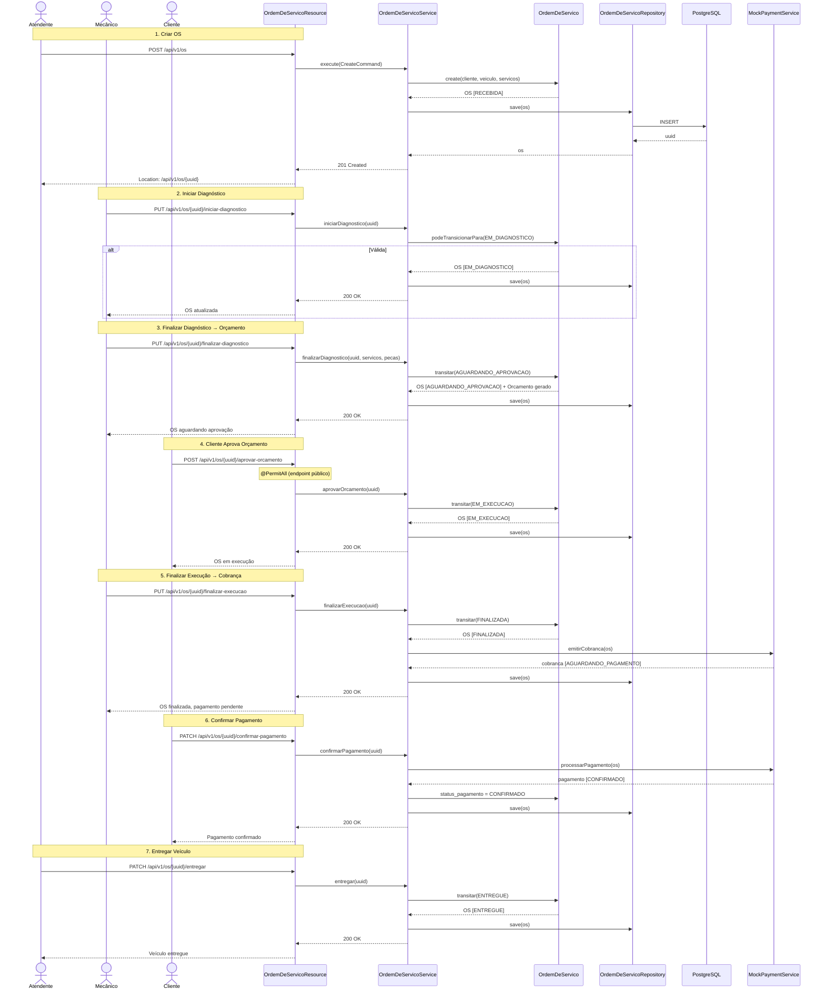
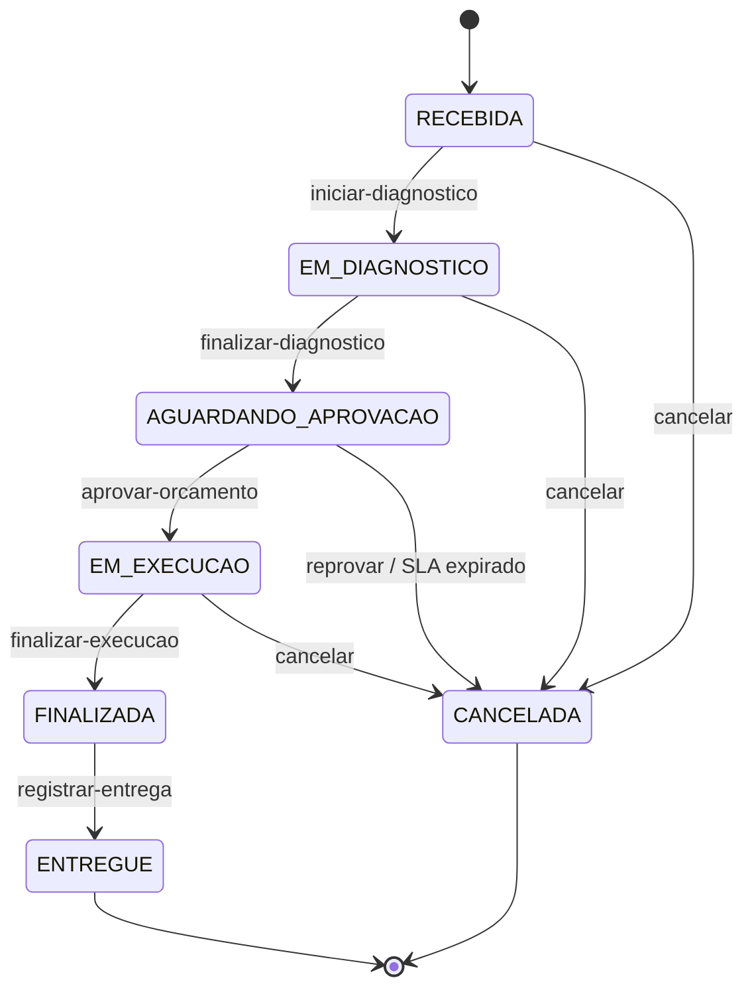
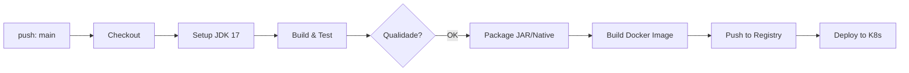

# Phase 8: Documentation & Polish — Research

**Researched:** 2026-08-08
**Domain:** Documentation, API metadata, Mermaid diagrams, Swagger/OpenAPI
**Confidence:** HIGH

## Summary

Phase 8 is a pure documentation phase — no code changes. It updates the README.md with v2.0 content (K8s, Terraform, HPA, load simulation), adds Mermaid sequence diagrams for the complete OS lifecycle and CI/CD pipeline, updates the Swagger/OpenAPI definition to v2.0.0, and produces a demo video. The existing docs/ directory has substantial material (EventStorming, 4 sequence diagrams, system documentation) that maps directly to DOC-10 (component docs). The CI pipeline is straightforward without CD yet — the CI/CD Mermaid task (DOC-07) must wait for Elias's INF-04.

**Primary recommendation:** Reuse existing docs/ content as-is for DOC-10; focus creative effort on the new README sections, the OS lifecycle Mermaid sequence diagram, and the Swagger version bump.

<user_constraints>
## User Constraints (from CONTEXT.md)

### Locked Decisions
- **D-01:** README.md existente será reestruturado para incluir: descrição da solução, objetivos da v2.0, instruções de execução local (docker-compose), deploy K8s (após Elias), Terraform (após Elias), HPA e simulação de carga
- **D-02:** Seção de troubleshooting do docker-compose (portas, network, chaves JWT) — resolvido na Fase 4
- **D-03:** Diagrama em Mermaid direto no README.md (versionável, sem ferramenta externa)
- **D-04:** Fluxo OS completo: criar OS → diagnosticar → orçar → aprovar → executar → finalizar → pagar → entregar
- **D-05:** Aguardar Elias implementar CD (INF-04) para criar diagrama completo. Task deve documentar dependência.
- **D-06:** Swagger/OpenAPI já disponível via Quarkus (quarkus-smallrye-openapi). Ajustar collection e disponibilizar link.
- **D-07:** Verificar se o Swagger UI está acessível em /q/swagger-ui ou /swagger
- **D-08:** Ajustar Miro refletindo a API atual — task manual para o responsável
- **D-09:** Documentar componentes da aplicação (4 módulos Maven), infraestrutura provisionada (Docker, K8s, RDS) e fluxo de deploy
- **D-10:** Explicar HPA (CPU 70%, Memory 80%, min 2, max 10) e como simular aumento de carga com `kubectl run -i --tty --image=busybox --restart=Never -- /bin/sh -c "while true; do wget -q -O- http://mekano-service:8080/api/v1/servicos; done"`
- **D-11:** Vídeo de até 15 min cobrindo: (1) Fluxo OS completo, (2) Chamadas de API, (3) Infra/containers, (4) Testes

### the agent's Discretion
- Estrutura exata do README (seções, ordem)
- Ferramenta de gravação de vídeo
- Link para Swagger (se será /q/swagger-ui ou customizado)

### Deferred Ideas (OUT OF SCOPE)
- CI/CD Mermaid diagram — depende de Elias implementar CD (INF-04)

</user_constraints>

<phase_requirements>
## Phase Requirements

| ID | Description | Research Support |
|----|-------------|------------------|
| DOC-04 | Gravar e disponibilizar vídeo demonstrativo do ambiente em execução (até 15 min) | 517 testes passando; docker-compose funcional; OS lifecycle endpoints fully implemented; HPA simulation command defined (D-10) |
| DOC-05 | Atualizar README.md com descrição da solução, objetivos da fase 2, instruções de execução local, deploy K8s e Terraform | README exists with basic sections; needs v2.0 goals, K8s/Terraform sections (after Elias), HPA explanation, load simulation |
| DOC-06 | Adicionar diagrama de sequência do fluxo de consumo de endpoints no README | Existing diagrams cover pieces; need full OS lifecycle sequence diagram in Mermaid (D-04); 4 existing sequence diagrams in docs/sequence-diagrams/ can be referenced |
| DOC-07 | Adicionar Mermaid do fluxo de CI/CD no README | CI pipeline at `.github/workflows/ci.yml` — simple build-only; CD not yet implemented (INF-04 by Elias); task must document dependency per D-05 |
| DOC-08 | Ajustar collection e disponibilizar link para collection completa das APIs (Postman/Swagger) | Postman collection `Mekano API v1.0.postman_collection.json` exists at root with 55+ endpoints; Swagger UI at `/q/swagger-ui` with `quarkus.swagger-ui.always-include=true` |
| DOC-09 | Ajustar Miro em relação à API | Miro board link in `docs/MEKANO_DOCUMENTATION.md` §5.2 — manual task for responsible person (D-08) |
| DOC-10 | Documentar componentes da aplicação, infraestrutura provisionada e fluxo de deploy | 4 Maven modules documented in `docs/MEKANO_DOCUMENTATION.md` and `CONTRIBUTING.md`; `docs/EventStorming_Mermaid.md` has class diagrams for all 3 bounded contexts; existing docs content can be directly referenced |
| DOC-11 | Explicar escalabilidade automática (HPA) e como simular aumento de carga no README | HPA parameters defined (D-10): CPU 70%, Memory 80%, min 2, max 10; load simulation command defined using busybox with wget loop |

</phase_requirements>

## Architectural Responsibility Map

This phase is purely documentation — no code changes. The "tiers" are content ownership:

| Capability | Primary Tier | Secondary Tier | Rationale |
|------------|-------------|----------------|-----------|
| README content | Repository root (README.md) | — | Single-source-of-truth for all user-facing docs |
| Swagger/OpenAPI | mekano-rest config | — | OpenAPI def in `MekanoApiApplication.java` + `openapi-config.yml` |
| Sequence diagrams | docs/sequence-diagrams/ | README.md (embed) | Existing diagrams stay in docs/; new OS lifecycle diagram embeds in README |
| Component docs | docs/ + AGENTS.md files | — | Already documented in `docs/MEKANO_DOCUMENTATION.md`, per-module AGENTS.md |
| Demo video | External artifact | README.md (link) | Not stored in repo; link in README |
| Miro board | External tool | — | Manual adjustment per D-08 |

## Standard Stack

### For Mermaid Diagrams (DOC-06, DOC-07)
| Library | Version | Purpose | Why Standard |
|---------|---------|---------|--------------|
| Mermaid (native markdown) | GitHub-flavored | Sequence diagrams, state diagrams, flowcharts | Rendered natively by GitHub — zero tooling, version-controlled |

### For Swagger/OpenAPI (DOC-08)
| Library | Version | Purpose | Why Standard |
|---------|---------|---------|--------------|
| quarkus-smallrye-openapi | 3.36.0 (matches Quarkus) | OpenAPI spec generation | Already bundled — no new dependency |
| Swagger UI | Bundled | Interactive API documentation | Default at `/q/swagger-ui`; `quarkus.swagger-ui.always-include=true` configured |

**Installation:** N/A — no new dependencies. Everything is already in the project.

### Swagger UI Access Points
| Environment | URL | Notes |
|-------------|-----|-------|
| Dev (local quarkus:dev) | `http://localhost:8080/q/swagger-ui` | Auto-enabled in dev mode |
| Docker Compose | `http://localhost:8080/q/swagger-ui` | `always-include=true` ensures it works |
| Production | `/q/swagger-ui` | Requires `always-include=true` (already set in `openapi-config.yml`) |
| OpenAPI JSON | `http://localhost:8080/q/openapi?format=json` | Raw OpenAPI spec |
| OpenAPI YAML | `http://localhost:8080/q/openapi` | Default format |

Customization available via [VERIFIED: Context7 /quarkusio/quarkus]:
- `quarkus.swagger-ui.path=my-custom-path` — changes Swagger UI URL
- `quarkus.smallrye-openapi.path=/swagger` — changes OpenAPI endpoint path
- Root path `/` is prohibited for Swagger UI

## Package Legitimacy Audit

> No external packages are installed in this phase. Phase is purely documentation — README edits, Mermaid diagrams, Swagger version bump, video recording.

| Package | Registry | Disposition |
|---------|----------|-------------|
| (none) | — | No packages to audit |

**Packages removed due to slopcheck [SLOP] verdict:** none
**Packages flagged as suspicious [SUS]:** none

## Architecture Patterns

### Pattern 1: README Structure for Multi-Environment Projects
**What:** A tiered README that serves both developers (quick start) and operators (deploy, scale).
**When to use:** Projects with dev, Docker Compose, and K8s deployment targets.
**Recommended order (based on Context D-01 + the agent's discretion):**

```
1. Title / Badges (build status, Java 17, Quarkus)
2. Descrição da Solução (objetivos v2.0)
3. Stack (technologies table)
4. Quick Start (docker-compose up)
5. Execução Local (quarkus:dev)
6. Autenticação JWT (seção existente)
7. API / Swagger (OpenAPI link + Postman)
8. Deploy (K8s + Terraform — após Elias)
9. Arquitetura (módulos Maven + diagrama)
10. Escalabilidade (HPA + simulação carga)
11. Fluxo OS (Mermaid sequence diagram)
12. CI/CD (Mermaid — após INF-04)
13. Testes (comandos existentes)
14. Estrutura do Projeto (tabela módulos)
15. Troubleshooting (portas, network, JWT)
```

### Pattern 2: Inline Mermaid Sequence Diagrams
**What:** Mermaid `sequenceDiagram` blocks embedded directly in markdown, rendered by GitHub.
**When to use:** For documenting API endpoint flows that span multiple actors/systems.
**Existing examples in codebase:**
- `docs/sequence-diagrams/criar-os.md` — OS creation flow with actor, resource, service, domain, repo, DB
- `docs/sequence-diagrams/iniciar-diagnostico.md` — Status transition with validation guard
- `CONTRIBUTING.md` — Payment & delivery flow with idempotency check

### Anti-Patterns to Avoid
- **External diagram tools:** D-03 locks Mermaid. Do NOT use Draw.io, LucidChart, or image files.
- **Stale Postman collection:** The collection at root is named "v1.0". Update to "v2.0" and add new endpoints (ClienteResource if implemented, OS lifecycle endpoints).
- **Hardcoded OpenAPI version:** `MekanoApiApplication.java` has `version = "1.0.0"` — must bump to `"2.0.0"`.

## Don't Hand-Roll

| Problem | Don't Build | Use Instead | Why |
|---------|-------------|-------------|-----|
| API documentation UI | Custom HTML page | Swagger UI (built-in Quarkus) | Already included via `quarkus-smallrye-openapi` |
| Diagram rendering | Image files | Mermaid (GitHub native) | Version-controlled, diffable, no binary assets |
| Video hosting | Store in git repo | External link (YouTube, Google Drive) | Git repos are not video hosts |

## Architecture Patterns Mapped to Code

### Existing OpenAPI Definition (needs version bump)
**Location:** `mekano-rest/src/main/java/com/fiap/mekano/rest/api/MekanoApiApplication.java`
**Current values:**
```java
@OpenAPIDefinition(
    info = @Info(
        title = "Mekano API",
        version = "1.0.0",
        description = "Clean Architecture REST API — FIAP Software Architecture"
    )
)
```

### Configuration File for Swagger
**Location:** `mekano-rest/src/main/resources/openapi-config.yml`
```yaml
quarkus:
  swagger-ui:
    always-include: true
mp:
  openapi:
    info:
      title: Mekano API
      version: 1.0.0
      description: Clean Architecture REST API — FIAP Software Architecture
```

> **Note:** `openapi-config.yml` also has `version: 1.0.0` that should be bumped to `2.0.0` to match the Java annotation.

## Existing Documentation Inventory

### docs/ Directory
| File | Content | Relevance to DOC Requirements |
|------|---------|-------------------------------|
| `docs/MEKANO_DOCUMENTATION.md` | Tech Challenge report: objectives, scope, tech stack, functional/non-functional requirements | DOC-10: Component docs — covers all 3 bounded contexts with RF tables |
| `docs/EventStorming_Mermaid.md` | Mermaid class diagrams + event flowcharts for OS, Estoque, Pagamento contexts | DOC-10: Architecture documentation — direct reuse |
| `docs/sequence-diagrams/criar-os.md` | Mermaid sequence: POST /api/v1/os → Resource → Service → Domain → Repo → DB | Inspo for DOC-06 OS lifecycle diagram |
| `docs/sequence-diagrams/iniciar-diagnostico.md` | Mermaid sequence: RECEBIDA → EM_DIAGNOSTICO transition with validation | Inspo for DOC-06 |
| `docs/sequence-diagrams/consulta-publica-status.md` | Mermaid sequence: GET /api/v1/os/{uuid}/status (@PermitAll) | Inspo for DOC-06 |
| `docs/sequence-diagrams/fluxo-completo-os-lifecycle.md` | Mermaid stateDiagram-v2: machine states from RECEBIDA to ENTREGUE | Inspo for DOC-06 — covers state transitions |

### Root Docs
| File | Content | Relevance |
|------|---------|-----------|
| `README.md` | Prerequisites, Quick Start, JWT, Tests, Postman, Project Structure | DOC-05: Must be restructured |
| `CONTRIBUTING.md` | Setup, Build, Structure, Patterns, Gotchas, Payment flow in Mermaid, Team workflow | Already comprehensive — may need minor updates for v2.0 |
| `Mekano API v1.0.postman_collection.json` | Postman collection with 55+ organized requests | DOC-08: Must be updated and linked |

### Postman Collection Details
- **Location:** Project root — `Mekano API v1.0.postman_collection.json`
- **Organization:** Folders for Auth, Cliente, Veículo, Serviço, Peça, OS lifecycle, Requisição Compra, NF Entrada, Alertas
- **Variables used:** `baseUrl` (default `http://localhost:8080/api/v1`), per-role tokens, UUIDs populated by scripts
- **Missing:** No ClienteResource folder (not yet implemented as of this research), no explicit Miro link
- **Update needed:** Rename to v2.0, add any new endpoints from Phases 4-7, verify token scripts still work

## Common Pitfalls

### Pitfall 1: Stale OpenAPI Version
**What goes wrong:** The OpenAPI spec at `/q/openapi` shows `version: 1.0.0` even after v2.0 features are implemented.
**Why it happens:** Both `MekanoApiApplication.java` and `openapi-config.yml` hardcode the version string.
**How to avoid:** Update BOTH files simultaneously. The Java annotation (`@OpenAPIDefinition`) and the YAML config both set `version`. If they disagree, one may override the other ([VERIFIED: Context7 /quarkusio/quarkus] — YAML config takes precedence over annotation when both are present).
**Warning signs:** Swagger UI header shows "Mekano API v1.0" after v2.0 work is done.

### Pitfall 2: Mermaid Not Rendering on GitHub
**What goes wrong:** Mermaid syntax errors cause blank diagrams on GitHub.
**Why it happens:** GitHub's Mermaid renderer is stricter than local editors. Common issues: unclosed participant aliases, invalid arrow syntax, missing alt/end wrapping.
**How to avoid:** Validate Mermaid syntax before committing. Use the [Mermaid Live Editor](https://mermaid.live/) or GitHub's built-in preview on PR.
**Warning signs:** Blank box where diagram should be; GitHub shows raw Mermaid code instead of rendered diagram.

### Pitfall 3: DOC-07 Blocked by INF-04
**What goes wrong:** The CI/CD Mermaid diagram task is attempted before Elias implements CD, creating an incomplete diagram.
**Why it happens:** The CI pipeline (`ci.yml`) only has `build` and `test` steps — no deploy stage. The Mermaid would show a truncated flow.
**How to avoid:** The task description in PLAN.md MUST explicitly state `Depends on: INF-04 (Elias)`. Document the CI-only partial state if done before INF-04, or defer entirely.
**Warning signs:** CD stage in diagram references jobs/steps that don't exist in the pipeline YAML.

### Pitfall 4: Demo Video Exceeds 15 Minutes
**What goes wrong:** Recording a single take that runs over the time limit.
**Why it happens:** Four coverage items (OS flow, API calls, Infra, Tests) with live demos naturally expand.
**How to avoid:** Script each segment with a strict time budget: OS flow (5 min), API calls (4 min), Infra/Containers (3 min), Tests (3 min). Record segments separately and edit.
**Warning signs:** First rehearsal exceeds 20 minutes.

## Mermaid Sequence Diagram Template (DOC-06)

The full OS lifecycle diagram for the README should cover this flow. Template based on existing patterns from `docs/sequence-diagrams/`:



> **Source:** Adapted from existing patterns in `docs/sequence-diagrams/criar-os.md`, `iniciar-diagnostico.md`, and `CONTRIBUTING.md` payment flow.

## Existing State Machine Diagram (for README reference)

The OS lifecycle state machine already exists in `docs/sequence-diagrams/fluxo-completo-os-lifecycle.md` and can be reused in the README's Arquitetura section:



## CI/CD Mermaid Template (DOC-07 — deferred)

To be completed AFTER INF-04 (Elias implements CD). Template structure:



> **Note:** Steps F-I depend on CD pipeline not yet implemented (INF-04). Only steps A-E are present in the current `ci.yml`.

## Code Examples

### Swagger OpenAPI Version Bump
**Source:** `mekano-rest/src/main/java/com/fiap/mekano/rest/api/MekanoApiApplication.java`
```java
@OpenAPIDefinition(
    info = @Info(
        title = "Mekano API",
        version = "2.0.0",  // BUMP from 1.0.0
        description = "Clean Architecture REST API — FIAP Software Architecture v2"
    )
)
```

### OpenAPI Config Version Bump
**Source:** `mekano-rest/src/main/resources/openapi-config.yml`
```yaml
mp:
  openapi:
    info:
      title: Mekano API
      version: 2.0.0  # BUMP from 1.0.0
      description: Clean Architecture REST API — FIAP Software Architecture v2
```

> **Note:** Both files must be updated. The YAML config takes precedence when both are present, but keeping them consistent avoids confusion.

### README Badges (suggested for top of restructured README)
```markdown


```

## State of the Art

| Old Approach (v1.0 README) | Current Approach (v2.0 README) | When Changed | Impact |
|---------------------------|-------------------------------|--------------|--------|
| Basic project description | Full solution description + v2.0 goals | Phase 8 | README becomes true project homepage |
| No architecture diagram | Mermaid state machine + sequence diagram in README | Phase 8 | Developers can visualize OS lifecycle without leaving README |
| No deploy docs | K8s + Terraform sections | After INF-04 | Operators can deploy from README |
| Swagger v1.0.0 | Swagger v2.0.0 | Phase 8 | API consumers see correct version |
| Postman collection v1.0 | Updated collection with new endpoints | Phase 8 | Testers have current endpoints |

## Assumptions Log

| # | Claim | Section | Risk if Wrong |
|---|-------|---------|---------------|
| A1 | `openapi-config.yml` version takes precedence over `@OpenAPIDefinition` annotation | Common Pitfalls | If wrong, annotation wins and bumping YAML only has no effect — both must be bumped anyway |
| A2 | ClienteResource is NOT yet implemented as of Phase 8 research | Postman Collection | If Elias/Conrado implemented it in Phases 4-7, the Postman collection needs those endpoints added too |
| A3 | CD pipeline does not exist (INF-04 not yet done) | CI/CD Mermaid | If INF-04 is completed before/during Phase 8, the CI/CD Mermaid can be created immediately instead of deferred |
| A4 | Video recording will use screen capture + editing | Demo Video | If team prefers screen recording only, time budget changes |

## Open Questions (RESOLVED)

1. **Does a ClienteResource exist now?**
   - What we know: `mekano-rest/AGENTS.md` says "NOT YET IMPLEMENTED — DTOs + mapper exist, no controller"
   - What's unclear: Later phases (4-7) may have added it
   - Recommendation: Grep for `ClienteResource.java` before planning — if exists, add to Postman collection

2. **Has INF-04 been completed by Elias?**
   - What we know: CI is build-only; CD is deferred
   - What's unclear: Elias may have finished CD during Phase planning
   - Recommendation: Check with Elias before creating DOC-07 task; if done, diagram is in scope; if not, document dependency

3. **What video recording tool to use?**
   - What we know: Four segments needed within 15 minutes total
   - What's unclear: Team preference (OBS Studio, Loom, QuickTime, etc.)
   - Recommendation: D-11 says "the agent's discretion" — recommend OBS Studio (free, cross-platform, supports scene switching for segment recording)

## Environment Availability

> Phase is documentation-only. No external dependencies beyond existing project files.

| Dependency | Required By | Available | Version | Fallback |
|------------|------------|-----------|---------|----------|
| git | Version control | ✓ | — | — |
| GitHub | Host README + Mermaid rendering | ✓ | — | — |
| Maven wrapper | Verify build commands in README | ✓ | 3.9.15 | — |
| Docker Compose | Verify quick start in README | ✓ | — | — |

## Validation Architecture

> This is a documentation phase with no code changes. Testing is limited to verifying README accuracy.

### Phase Requirements → Validation

| Req ID | Behavior | Validation Method | Command |
|--------|----------|-------------------|---------|
| DOC-04 | Video covers 4 segments within 15 min | Manual review | — |
| DOC-05 | README sections reflect actual project state | Manual review + `docker compose up -d` to verify instructions | `docker compose up -d` |
| DOC-06 | Mermaid renders correctly on GitHub | Push to PR branch, check GitHub preview | `git push origin feature/doc-06` |
| DOC-07 | CI/CD Mermaid matches pipeline YAML (when available) | Compare diagram against `.github/workflows/*.yml` | — |
| DOC-08 | Swagger UI accessible + Postman collection imports | `curl http://localhost:8080/q/swagger-ui` + Postman import | `curl -s -o /dev/null -w "%{http_code}" http://localhost:8080/q/swagger-ui` |
| DOC-09 | Miro reflects current API | Manual Miro board audit | — |
| DOC-10 | Component docs match actual 4-module structure | Grep project structure matches docs | `ls -d mekano-*/` |
| DOC-11 | HPA params + load command work | `kubectl` commands documented, not executed in this phase | — |

## Security Domain

> This phase makes no code changes. Security enforcement applies only to accuracy of documented auth information in README and Swagger.

### Applicable ASVS Categories

| ASVS Category | Applies | Rationale |
|---------------|---------|-----------|
| V2 Authentication | Review only | README documents JWT auth flow — verify accuracy against actual code |
| V3 Session Management | Review only | Refresh token docs should match actual `/auth/refresh` implementation |
| V4 Access Control | Review only | README `@RolesAllowed` table must match actual resource annotations |

**No security implementation — this is a documentation-only phase.**

## Sources

### Primary (HIGH confidence)
- [VERIFIED: Codebase inspection] — `openapi-config.yml`: Swagger UI `always-include=true`, version `1.0.0`
- [VERIFIED: Codebase inspection] — `MekanoApiApplication.java`: `@OpenAPIDefinition(version = "1.0.0")`
- [VERIFIED: Codebase inspection] — `.github/workflows/ci.yml`: build-only pipeline (no CD)
- [VERIFIED: Codebase inspection] — `Mekano API v1.0.postman_collection.json`: exists at root with 55+ endpoints
- [VERIFIED: Codebase inspection] — `docs/MEKANO_DOCUMENTATION.md`: comprehensive system documentation
- [VERIFIED: Codebase inspection] — `docs/EventStorming_Mermaid.md`: full Mermaid class/event diagrams
- [VERIFIED: Codebase inspection] — `docs/sequence-diagrams/`: 4 Mermaid diagrams (create OS, diagnosis, status query, lifecycle state machine)
- [VERIFIED: Codebase inspection] — `CONTRIBUTING.md`: payment flow Mermaid, patterns, gotchas
- [VERIFIED: Context7 /quarkusio/quarkus] — Swagger UI default path `/q/swagger-ui`, customization via `quarkus.swagger-ui.path`, YAML config takes precedence over annotation

### Secondary (MEDIUM confidence)
- [CITED: GitHub docs] — Mermaid rendering in GitHub markdown: https://docs.github.com/en/get-started/writing-on-github/working-with-advanced-formatting/creating-diagrams

### Tertiary (LOW confidence)
- [ASSUMED] — ClienteResource still not implemented (checked against `mekano-rest/AGENTS.md`; later phases may have added it)
- [ASSUMED] — CD pipeline still not implemented (checked against `ci.yml`; INF-04 may have been completed)
- [ASSUMED] — OBS Studio as recommended video tool (free, cross-platform, open source)

## Metadata

**Confidence breakdown:**
- Standard stack: HIGH — all tools already present in project
- Architecture: HIGH — existing docs/ structure fully inventoried
- Pitfalls: HIGH — verified against actual codebase state and Quarkus docs
- OpenAPI config: HIGH — confirmed via Context7

**Research date:** 2026-08-08
**Valid until:** 2026-09-08 (stable project — no fast-moving dependencies)