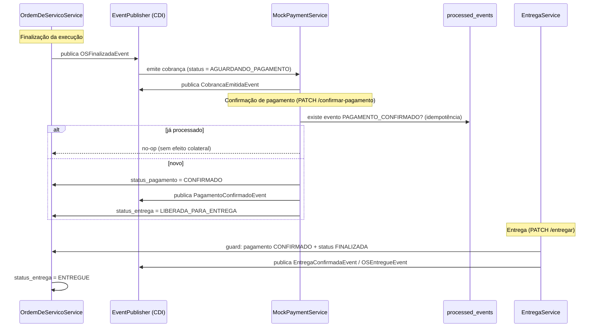

# Contributing — Mekano

Guia de contribuição para desenvolvedores do projeto **Mekano** — API REST para gestão de oficina mecânica (ordens de serviço, clientes, veículos, estoque e faturamento).

## Sumário

1. [Setup](#setup)
2. [Comandos de build e teste](#comandos-de-build-e-teste)
3. [Estrutura do projeto](#estrutura-do-projeto)
4. [Padrões do código](#padrões-do-código)
5. [Gotchas conhecidos](#gotchas-conhecidos)
6. [Fluxo de Pagamento & Entrega](#fluxo-de-pagamento--entrega)
7. [Workflow do time](#workflow-do-time)

---

## Setup

### Pré-requisitos

- **Java 17** (configurado via `JAVA_HOME`)
- **Docker Desktop** ou **Rancher Desktop** instalado e em execução
- **Maven Wrapper** (`./mvnw` incluso no projeto — não precisa instalar Maven)

### Dev (Docker Compose + keygen automático)

```bash
# 1. Build + sobe tudo (postgres, keygen, app)
docker compose up -d

# 2. A app estará em http://localhost:8080
#    Swagger UI: http://localhost:8080/q/swagger-ui
```

> O `Dockerfile.jvm` é multi-stage: compila o JAR internamente e depois gera a imagem runtime. O serviço `keygen` gera o par de chaves Ed25519 na primeira execução.

### Dev local (sem Docker)

```bash
# 1. Suba apenas o banco
docker compose up -d postgres

# 2. Gere as chaves JWT (necessário apenas uma vez)
./mekano-rest/keygen.sh

# 3. Inicie o Quarkus em modo dev
./mvnw quarkus:dev
```

> Quarkus Dev UI em <http://localhost:8080/q/dev/>. Flyway, JWT e CORS são configurados automaticamente. Em testes, o Flyway **não roda** — o Hibernate usa `drop-and-create` com H2 em modo PostgreSQL.

### Prod (bind mount da chave do host)

```bash
./mekano-rest/keygen.sh                                   # uma vez
cp ~/.mekano/secrets/*.pem /etc/mekano/secrets/           # chaves para o host
docker compose -f docker-compose.prod.yml up -d
```

---

## Comandos de build e teste

```bash
./mvnw verify -pl mekano-rest -am                                   # suíte completa
./mvnw test -pl mekano-domain                                       # testes unitários (<3s)
./mvnw test -pl mekano-application -am                              # Mockito (services)
./mvnw test -pl mekano-infrastructure -am                           # integração (repos/listeners)
./mvnw test -pl mekano-rest -am                                     # E2E REST Assured

./mvnw package -Dnative -pl mekano-rest -am                         # build nativo
```

Testes específicos:

```bash
./mvnw test -pl mekano-rest -am -Dtest=*Pagamento*                 # pagamento E2E
./mvnw test -pl mekano-domain -am -Dtest=*CicloCobrancaPagamento*  # transições de pagamento/entrega
```

---

## Estrutura do projeto

```
mekano-rest (quarkus packaging — entrypoint)
  ├── mekano-application (casos de uso, @Transactional)
  ├── mekano-infrastructure (JPA, repositórios, mappers, Flyway, listeners CDI)
  └── mekano-domain (entidades puras, VOs, ports, eventos — zero deps de framework)
```

O grafo de dependência é estrito: `domain` não conhece `infrastructure`/`application`/`rest`; `application` depende só de `domain`; `rest` orquestra todos.

---

## Padrões do código

| Conceito | Padrão |
|----------|--------|
| Entidades | POJO no domain, `@Builder(access = PRIVATE)`, factory estática `create()` + `reconstitute()` |
| ID híbrido | `Long id` (auto-increment, PK interna) + `UUID uuid` (único, exposto nas APIs) |
| Value Objects | Imutáveis, validação no construtor, `@EqualsAndHashCode` por valor |
| Ports | Interfaces puras em `domain/port/` — sem anotações de framework |
| Services | `@ApplicationScoped`, injeção por construtor, `@Transactional` nos métodos de escrita |
| Resources | `@RequestScoped` (obrigatório com JWT + UriInfo), `@RolesAllowed`, **nunca** `@Transactional` |
| DTOs | Input = classe Lombok, Output = record |
| Exceções | `AppException(RuntimeException)` com `int status`; `ApiExceptionMapper` retorna RFC 7807 (`application/problem+json`) |
| MapStruct | `@Mapper(componentModel = "cdi")` — nunca `"spring"` |
| Eventos | Records imutáveis em `domain/event/`; publicação via `EventPublisher` (CDI) |
| Soft delete | `isActive` + `deletedAt` |
| State machines | Matriz de transição `Map<Status, Set<Status>>` + `podeTransicionarPara()` como fonte única de verdade |
| Audit | `os_audit_log` — transições da OS logadas automaticamente via listeners |

### Regras que nunca devem ser violadas

- **Nunca** coloque `@Transactional` em Resource ou Repository — o use case (application) é a fronteira transacional (D-01).
- **Nunca** exponha `passwordHash` ou entidades `User` em records de resposta (D-04).
- **Nunca** use `@ApplicationScoped` em Resource que injeta JWT/UriInfo (G8).
- Mudanças de status da OS só via métodos de transição explícitos — **nunca** `setStatus()` direto (evita lost updates).
- Eventos de domínio são records imutáveis e não podem conter anotações de framework (D-15/D-17).

---

## Gotchas conhecidos

| # | Problema | Fix |
|---|----------|-----|
| G1 | `quarkus-maven-plugin` em módulo não-quarkus | Plugin **somente** em mekano-rest (skip=true nos demais) |
| G2 | Falta de Jandex | `jandex-maven-plugin` em app/infra/rest |
| G3 | Ordem errada de annotation processors | Lombok → lombok-mapstruct-binding → mapstruct-processor |
| G4 | Flyway V1 sem underscore duplo | `V1__desc.sql` |
| G5 | Migrations não rodam em start | `quarkus.flyway.migrate-at-start=true` |
| G6 | Usar namespace `quarkus.smallrye-jwt.*` | Usar `mp.jwt.*` |
| G7 | Chave RSA não-PKCS#8 | Usar PKCS#8 ou Ed25519 |
| G8 | `@ApplicationScoped` em Resource com JWT | Usar `@RequestScoped` |
| G9 | MapStruct `componentModel = "spring"` | Sempre `"cdi"` |
| G10 | ExceptionMapper sem `@Provider` | `@Provider @ApplicationScoped` |
| G11 | Impls MapStruct deletadas pela recompilação de test-compile | `maven-compiler-plugin` com `<useIncrementalCompilation>false</useIncrementalCompilation>` em mekano-rest |
| G12 | Versões Flyway duplicadas | Versões únicas por V-file |
| G13 | Plugin compiler duplicado no POM pai | Declaração única com annotation paths do Lombok |
| H2 | `BIGSERIAL` não suportado em testes | `BIGINT GENERATED BY DEFAULT AS IDENTITY`; sem `ADD COLUMN` múltiplo |

---

## Fluxo de Pagamento & Entrega

O pagamento é modelado **como campos da OS** (não entidade separada — D-01). A cobrança é emitida automaticamente ao finalizar a execução e a entrega é bloqueada até o pagamento ser confirmado.

### Estados

**StatusPagamento:** `NAO_COBRADO → AGUARDANDO_PAGAMENTO → CONFIRMADO` (com `CANCELADO` saindo de NAO_COBRADO/AGUARDANDO_PAGAMENTO)

**StatusEntrega:** `NAO_LIBERADA → LIBERADA_PARA_ENTREGA → ENTREGUE`

### Endpoints

| Endpoint | Descrição |
|----------|-----------|
| `PATCH /api/v1/os/{id}/confirmar-pagamento` | Confirma pagamento via banco simulado (`MockPaymentService`) — 409 se não estiver pendente, 503 se mock indisponível |
| `PATCH /api/v1/os/{id}/entregar` | Registra entrega do veículo — 422 se pagamento pendente ou OS não finalizada |
| `GET /api/v1/os/{id}` / `/detalhamento` | Retorna `statusPagamento`, `statusEntrega`, `referenciaPagamento` e `pagamentoConfirmadoEm` (D-22: sem endpoint dedicado de pagamentos) |

### Idempotência

Pagamentos duplicados não geram efeito colateral: antes de processar, o sistema verifica a tabela `processed_events` (migration V30) via `ProcessedEventRepositoryImpl` — um webhook/call duplicado é ignorado silenciosamente.

### Fluxo (Mermaid)



### Diagramas existentes

Os fluxos da OS (criar OS, iniciar diagnóstico, consulta pública, lifecycle completo) estão em `docs/sequence-diagrams/`:

- `criar-os.md`
- `iniciar-diagnostico.md`
- `consulta-publica-status.md`
- `fluxo-completo-os-lifecycle.md`

---

## Workflow do time

- **Issues como tarefas:** cada wave da Fase tem issues no GitHub com descrição, arquivos afetados e critérios de aceitação. Comece um PR por issue.
- **Branches:** `main` e `develop` devem permanecer alinhadas; feature branches nomeadas `feat/<numero>-<descricao>`.
- **Testes:** nenhuma feature entra sem teste na camada correspondente (unit no domain, Mockito no application, integração no infrastructure, REST Assured no rest).
- **Qualidade:** JaCoCo com cobertura mínima de 80% de linhas; OWASP Dependency Check com gate CVSS ≥ 7 (CI).
- **CI:** `.github/workflows/ci.yml` roda a suíte completa em cada PR.
- **Documentação:** mudanças de contrato de API devem refletir no Swagger (anotações OpenAPI) e neste guia.
