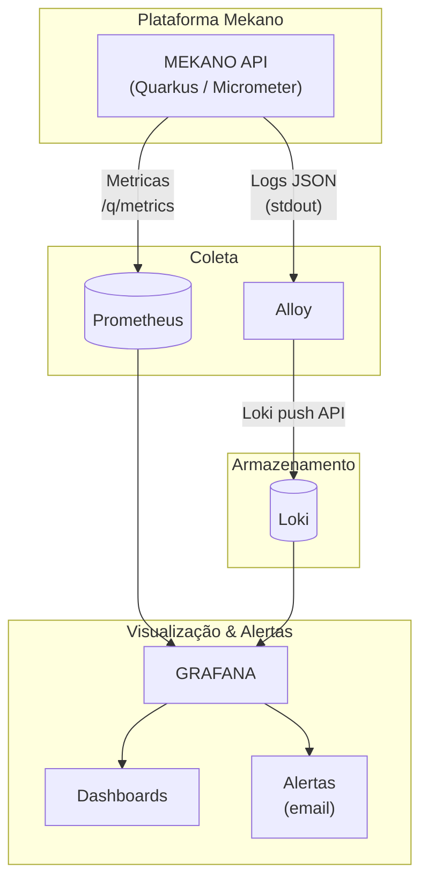

# Mekano — Monitoramento e Observabilidade

Documentação da stack de observabilidade do Mekano-API: **Prometheus** (métricas), **Grafana Alloy** e **Loki** (logs) e **Grafana** (visualização e alertas). Todos os serviços fazem parte do `docker-compose.yml` na raiz do repositório.

## Arquitetura



O Mekano-API expõe métricas Micrometer em `/q/metrics` (via `quarkus-micrometer-registry-prometheus`) e emite logs estruturados em JSON (`quarkus.log.console.json=true`), coletados pelo Alloy a partir do socket do Docker.

## Componentes da stack

| Componente | Papel | Porta | Arquivo de configuração |
|------------|-------|-------|--------------------------|
| Prometheus | Coleta métricas do endpoint `/q/metrics` (scrape a cada 15s) | 9090 | `infra_metrics_monitoring/prometheus/prometheus.yml` |
| Grafana Alloy | Descobre containers Docker e coleta logs | 12345 | `infra_metrics_monitoring/alloy/config.alloy` |
| Loki | Armazena os logs enviados pelo Alloy | 3100 | config embutida (`local-config.yaml`) |
| Grafana | Dashboards, datasources e alertas | 3000 | `infra_metrics_monitoring/grafana/provisioning/` |

## Configuração e provisionamento

- **Prometheus** — `infra_metrics_monitoring/prometheus/prometheus.yml`: job `mekano-api` apontando para `mekano:8080/q/metrics`.
- **Alloy** — `infra_metrics_monitoring/alloy/config.alloy`: descoberta via `discovery.docker`, labels `job=docker` e `service_name` (nome do container), encaminhamento para a API push do Loki.
- **Grafana datasources** — `infra_metrics_monitoring/grafana/provisioning/datasource.yml`: **Prometheus** (data source padrão) e **Loki**.
- **Grafana dashboards** — `infra_metrics_monitoring/grafana/provisioning/dashboards.yml`: auto-provisioning na pasta **MEKANO API** a partir da pasta `grafana/dashboards/`.
- **Grafana alertas** — `infra_metrics_monitoring/grafana/provisioning/alerts/alerting.yml` e `contact-points.yml`.

## Dashboards

Pasta: `infra_metrics_monitoring/grafana/dashboards/`

| Dashboard | Arquivo | Conteúdo |
|-----------|---------|----------|
| `dashboard_metrics` | `dashboard_metrics.json` | Infra do servidor: CPU, memória, GC, threads, pool de conexões, SLA e uptime |
| `OS FLOW TRAFFIC` | `os_flow_monitoring.json` | Tráfego HTTP (req/s, latência, taxas 400/500) e fluxo de ordens de serviço (criadas, transições, tempo por etapa) |
| `LOKI` | `loki.json` | Logs estruturados por camada (OS, Orçamento, Req. Compra/NFe, WhatsApp) e métricas por level (INFO/WARN/ERROR) |

A especificação do conteúdo de cada painel está documentada em `grafana/dashboards/estrutura_dashboard.md`.

## Alertas

Regras provisionadas no `alerting.yml` (grupo de avaliação de 1 min), notificando por email:

| Alerta | Condição |
|--------|----------|
| MEKANO-API - TAXA HTTP 400 | Taxa de erros 400 ≥ 20% na última hora |
| MEKANO-API - TAXA HTTP 500 | Taxa de erros 500 ≥ 5% na última hora |
| MEKANO-API - SYSTEM DOWN | Métrica `up` igual a zero (API fora do ar) |

Destinatário configurado em `contact-points.yml` (*Dev - Sistema de Alertas*). O envio de email usa as variáveis `GF_SMTP_*` definidas no `docker-compose.yml`.

## Como executar

Todos os serviços de observabilidade sobem junto com a stack:

```powershell
docker compose up -d
```

Acessos:

| Serviço | URL |
|---------|-----|
| Grafana (dashboards/alertas) | http://localhost:3000 |
| Prometheus (métricas) | http://localhost:9090 |
| Loki (API de logs) | http://localhost:3100 |
| Alloy (UI de depuração) | http://localhost:12345 |