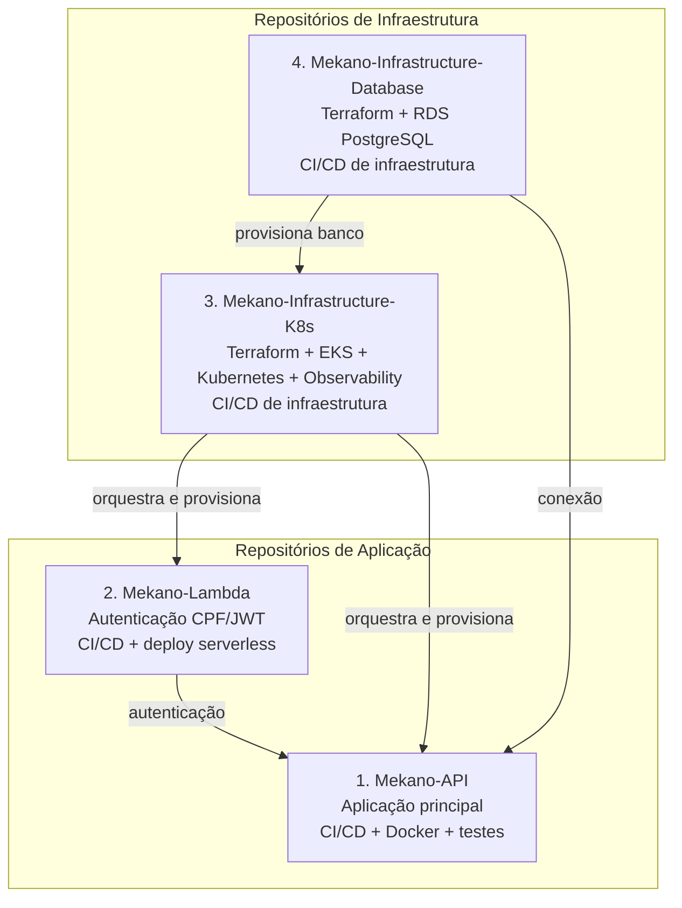

# Mekano — Estrutura de Repositórios Git

```text
┌───────────────────────────────────────────────┐
│ 1. Mekano-API                                 │
│ Aplicação principal                           │
│ CI/CD + Docker + testes                       │
└───────────────────────────────────────────────┘

┌───────────────────────────────────────────────┐
│ 2. Mekano-Lambda                              │
│ Autenticação CPF/JWT                          │
│ CI/CD + deploy serverless                     │
└───────────────────────────────────────────────┘

┌───────────────────────────────────────────────┐
│ 3. Mekano-Infrastructure-K8s                  │
│ Terraform + EKS + Kubernetes + Observability  │
│ CI/CD de infraestrutura                       │
└───────────────────────────────────────────────┘

┌───────────────────────────────────────────────┐
│ 4. Mekano-Infrastructure-Database             │
│ Terraform + RDS PostgreSQL                    │
│ CI/CD de infraestrutura                       │
└───────────────────────────────────────────────┘
```


