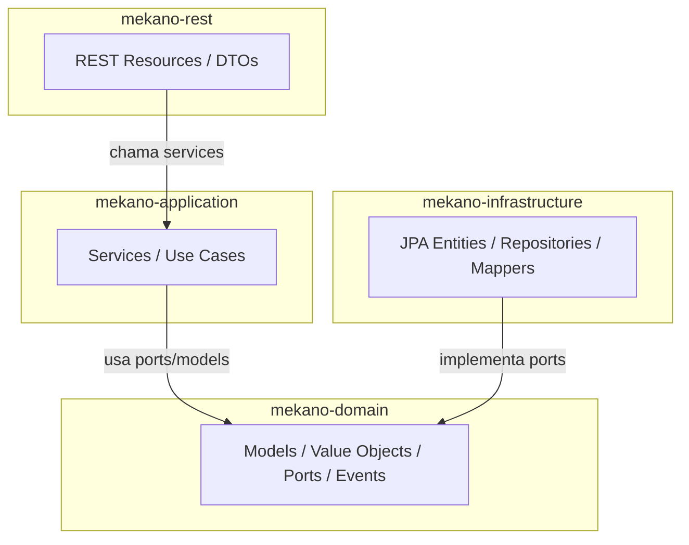

# MEKANO-API

API REST para gestao de oficina mecanica — gestao completa do ciclo de vida da Ordem de Servico, incluindo clientes, veiculos, estoque, orcamento, pagamento e entrega.

## Equipe

| Nome | Email |
| ------ | ------- |
| Conrado Moura | <conrado.moura@icloud.com> |
| Elias Ferreira | <eliaspsm2@gmail.com> |
| Giovanni Brasil | <giovannisbrasil@gmail.com> |
| Roger Toledo | <rogertoledo28@gmail.com> |
| Victor Souza | <victor.souza2210@gmail.com> |

## Sobre o Projeto

O MEKANO-API e um Sistema Integrado de Atendimento e Execução de Servicos para oficinas mecanicas. A solução gerencia o ciclo completo das Ordens de Servico — do recebimento do veiculo a entrega — com rastreabilidade, controle de estoque e cobranca integrados.

A aplicação foi construida seguindo os principios de **Domain-Driven Design (DDD)** e **Clean Architecture**, separando responsabilidades em camadas isoladas e independentes de framework.

## Objetivos da Fase 2

A versão 2.0 do projeto evolui a solução MVP da Fase 1 incorporando:

- **Infraestrutura escalavel**: containerização com Docker, orchestração com Kubernetes (EKS) e provisionamento via Terraform
- **Automação de deploy**: pipeline CI/CD integrada com build, testes e publicação de imagem
- **Qualidade assegurada**: cobertura de testes automatizados com gate de qualidade via JaCoCo
- **Resiliencia**: health checks, politicas de restart e escalabilidade dinamica via HPA

## Principais Funcionalidades

- Gestao de clientes, veiculos, servicos e pecas
- Ciclo de vida completo da Ordem de Servico: Recebida, Em Diagnostico, Aguardando Aprovação, Em Execução, Finalizada, Entregue
- Geração automática de orçamento com aprovação via API
- Controle de estoque com reservas, requisicoes de compra e notas fiscais
- Cobrança automática e confirmação de pagamento
- Consulta publica de status da OS pelo cliente
- Autenticação JWT com roles diferenciadas (admin, atendente, mecanico, financeiro, cliente)
- Integração com WhatsApp via Evolution API para notificações

## Stack Tecnologica

| Camada | Tecnologia |
| -------- | ------------ |
| Backend | Java 17, Quarkus 3.36.0 |
| Arquitetura | Clean Architecture, DDD |
| Banco de dados | PostgreSQL 16 |
| Mapeamento | MapStruct 1.6.3, Lombok 1.18.46 |
| Testes | JUnit 5, Mockito, REST Assured, AssertJ |
| Cobertura | JaCoCo 0.8.15 (gate: 80% LINE) |
| Documentação API | OpenAPI / Swagger UI |
| Autenticação | JWT (Ed25519/EdDSA) via SmallRye |
| Containers | Docker (multi-stage build) |
| CI/CD | GitHub Actions |
| Cache | Caffeine |
| WhatsApp | Evolution API |
| Resiliencia | SmallRye Fault Tolerance |

## Como Executar o Projeto

### Execução Localhost

- [locahost](docs/project-execution/locahost.md)

### Execução Produção (subindo infraestrutura AWS)

- [produção](docs/project-execution/production.md)

### Credenciais Iniciais

A migration V32 cria um usuario admin inicial:

| Campo | Valor |
| ------- | ------- |
| E-mail | `admin@mekano.com.br` |
| Senha | `Mekano@2024` |
| Role | `admin` |

### SOBRE A API REST

#### Prefixo

Todos os endpoints estao sob o prefixo `/api/v1`.

#### Endpoints Principais

| Recurso | Metodo | Path | Roles |
| --------- | -------- | ------ | ------- |
| Login | POST | `/api/v1/auth/login` | Publico |
| Refresh Token | POST | `/api/v1/auth/refresh` | Publico |
| Logout | POST | `/api/v1/auth/logout` | Publico |
| Listar OS | GET | `/api/v1/os` | admin, atendente |
| Criar OS | POST | `/api/v1/os` | admin, atendente |
| Status OS | GET | `/api/v1/os/{uuid}/status` | Publico |
| Iniciar Diagnostico | PUT | `/api/v1/os/{uuid}/iniciar-diagnostico` | mecanico, admin |
| Finalizar Diagnostico | PUT | `/api/v1/os/{uuid}/finalizar-diagnostico` | mecanico, admin |
| Aprovar Orcamento | PUT | `/api/v1/orcamentos/{uuid}/aprovar` | Publico |
| Reprovar Orcamento | PUT | `/api/v1/orcamentos/{uuid}/reprovar` | Publico |
| Iniciar Execução | PUT | `/api/v1/os/{uuid}/iniciar-execucao` | mecanico, admin |
| Finalizar Execução | PUT | `/api/v1/os/{uuid}/finalizar-execucao` | mecanico, admin |
| Confirmar Pagamento | PUT | `/api/v1/os/{uuid}/confirmar-pagamento` | financeiro |
| Entregar | PUT | `/api/v1/os/{uuid}/entregar` | admin, atendente |
| Cancelar OS | PUT | `/api/v1/os/{uuid}/cancelar` | admin |
| Listar Clientes | GET | `/api/v1/clientes` | admin, atendente |
| CRUD Veiculos | * | `/api/v1/veiculos` | admin, atendente |
| CRUD Servicos | * | `/api/v1/servicos` | admin |
| Listar Pecas | * | `/api/v1/pecas` | admin |
| Requisicoes de Compra | * | `/api/v1/requisicoes-compra` | admin |
| NF de Entrada | * | `/api/v1/nf-entrada` | admin |
| Alertas Estoque | GET | `/api/v1/alertas` | admin, atendente |
| Audit OS | GET | `/api/v1/os/{uuid}/audit` | admin, atendente, mecanico, financeiro |

#### Postman Collection

A collection completa da API esta disponivel em:

> **[newman/Mekano_API_V2.0.postman_collection.json](newman/Mekano_API_V2.0.postman_collection.json)**

Para utilizar:

1. Importar o arquivo no Postman
2. Fazer login via `POST /api/v1/auth/login` para obter o token JWT
3. Utilizar o token nas requisicoes autenticadas

## Arquitetura

### Visão Geral

O projeto segue **Clean Architecture** com separação estrita de camadas. O dominio nao possui dependencias de framework; a aplicação orquestra os casos de uso; a infraestrutura implementa as interfaces de persistencia e integração; e a camada REST expoe os endpoints.



### Modulos Maven

#### / **mekano-domain**

Responsabilidade: nucleo do dominio, livre de dependencias de framework.

Principais componentes:

- Entities e enums (OrdemDeServico, Cliente, Veiculo, Peca, Servico, Orçamento, etc.)
- Value Objects com validação no construtor (Email, CPF, Telefone, Placa, Endereco)
- Ports de entrada e saida (interfaces para servicos e repositorios)
- Events de dominio (OrdemDeServicoCriadaEvent, CobrancaEmitidaEvent, etc.)

Dependencias: apenas Lombok (provided).

#### / **mekano-application**

Responsabilidade: orquestração dos casos de uso e logica de negocios.

Principais componentes:

- Servicos de dominio (OrdemDeServicoService, ClienteService, VeiculoService, etc.)
- Servicos de autenticação (AuthService, RefreshTokenService)
- Listeners de eventos (CobrancaEmitidaListener)
- Integração WhatsApp (WhatsAppOrçamentoRespostaService)

Dependencias: mekano-domain, quarkus-arc.

#### / **mekano-infrastructure**

Responsabilidade: adaptadores para persistencia, seguranca e integração externa.

Principais componentes:

- JPA Entities (14 entidades Panache)
- Repositories (28 repositorios Panache)
- Mappers (18 mappers MapStruct)
- Flyway migrations (34 arquivos SQL)
- Seguranca (BcryptPasswordHasher, SmallRyeAccessTokenIssuer)
- Observers e listeners CDI
- Integração WhatsApp (EvolutionApiRestClient, EvolutionApiNotifier)
- Cache (Caffeine)

Dependencias: mekano-domain, mekano-application, Quarkus Hibernate ORM Panache, Flyway, SmallRye JWT, SmallRye Fault Tolerance.

#### / **mekano-rest**

Responsabilidade: camada de entrada REST, DTOs, configuração e health checks.

Principais componentes:

- Resources REST (12 endpoints: OS, Clientes, Veiculos, Servicos, Pecas, Orcamentos, Requisicoes de Compra, NF de Entrada, Alertas, Auth, Admin Users, Webhooks)
- DTOs de entrada (Lombok) e saida (records)
- ApiExceptionMapper (RFC 7807 Problem Details)
- ApplicationLivenessCheck (@Liveness)
- Configuracoes (application.properties, YAMLs)

Dependencias: mekano-domain, mekano-application, mekano-infrastructure, Quarkus REST Jackson, SmallRye OpenAPI, SmallRye Health, Micrometer/Prometheus.

### Fluxo da Ordem de Servico

A Ordem de Servico percorre os seguintes estados:

```
Criar (Recebida)
  -> Diagnosticar (Em Diagnostico)
    -> Orcar (Aguardando Aprovação)
      -> Aprovar (Em Execução) / Reprovar (Cancelada)
        -> Executar (Em Execução)
          -> Finalizar (Finalizada)
            -> Pagar (Pagamento Confirmado)
              -> Entregar (Entregue)
```

Diagramas detalhados do fluxo estao disponiveis em:

- [Fluxo completo do ciclo de vida da OS](docs/sequence-diagrams/fluxo-completo-os-lifecycle.md)
- [Criar OS](docs/sequence-diagrams/criar-os.md)
- [Iniciar diagnostico](docs/sequence-diagrams/iniciar-diagnostico.md)
- [Consulta publica de status](docs/sequence-diagrams/consulta-publica-status.md)
- [Fluxo Requisição de Compra - Estoque Mínimo](/docs/sequence-diagrams/requisicao-compra-estoque-minimo.md)

## Diagrama de Arquitetura AWS

### Diagrama geral

- [Fluxo completo do o cliente até os serviços externos.](docs/aws-infrastructure/global-scope-architecture.md)

### Diagrama de arquitetura da VPC

- [Layout de subnets, componentes de rede e fluxo de tráfego.](docs/aws-infrastructure/vpc-scope-architecture.md)

## Deploy (Infrasestrutura AWS, Terraform e K8s)

[Documentação INFRA](./README-INFRA.md)

## Testes

### Testes Unitarios

```bash
# Todos os modulos
./mvnw test

# Apenas dominio
./mvnw test -pl mekano-domain

# Apenas aplicação
./mvnw test -pl mekano-application -am
```

### Testes de Integração

```bash
# Infraestrutura (requer H2 em memoria)
./mvnw test -pl mekano-infrastructure -am

# REST (requer QuarkusTest)
./mvnw test -pl mekano-rest -am
```

### Build Completo com Todos os Testes

```bash
./mvnw -B -ntp verify -pl mekano-rest -am
```

### Testes Funcionais (Newman)

```bash
# Requer a aplicação rodando via Docker Compose
newman run newman/Mekano_API_V2.0.postman_collection.json --reporters cli
```

### Cobertura

O projeto utiliza **JaCoCo** com gate de 80% de cobertura LINE. O relatorio agregado e gerado no modulo `mekano-rest`.

```bash
# Gerar relatorio de cobertura
./mvnw verify -pl mekano-rest -am

# Relatorio disponivel em:
# mekano-rest/target/site/jacoco-aggregate/index.html
```

## Escalabilidade

### HPA

> Configuração do Horizontal Pod Autoscaler com metricas de CPU/memoria e politicas de escalabilidade

- Quantidade mínima de PODs: 2;
- Quantidade máxima de PODs: 10;
- Triggers:
  - Memory: 70%;
  - CPU: 80%;

## Troubleshooting

| Problema | solução |
| ---------- | --------- |
| Container nao inicia | Verificar se Docker esta rodando: `docker compose ps` |
| Porta 8080 ocupada | Encerrar processo na porta ou alterar a porta no `docker-compose.yml` |
| Banco indisponivel | Aguardar health check: `docker compose logs postgres` |
| Chaves JWT nao encontradas | Executar `./mekano-rest/keygen.sh` ou reiniciar com `docker compose down -v && docker compose up -d --build` |
| Migration falhou | Verificar logs: `docker compose logs mekano` ou executar `make migrate-status` |
| Swagger nao carrega | Verificar se a aplicação esta saudavel: `curl http://localhost:8080/q/health/live` |

## Documentação EventStorming e Video Demonstrativo

> [Link do Vídeo](https://www.youtube.com/watch?v=D7l2XHGrpuY)
> [Link do Miro](https://miro.com/app/board/uXjVHD4vUnU=/)
> [Swagger de Produção na AWS](http://aaa4e3808aeee403b8da43e46d7e517a-1862017952.us-east-1.elb.amazonaws.com/q/swagger-ui)