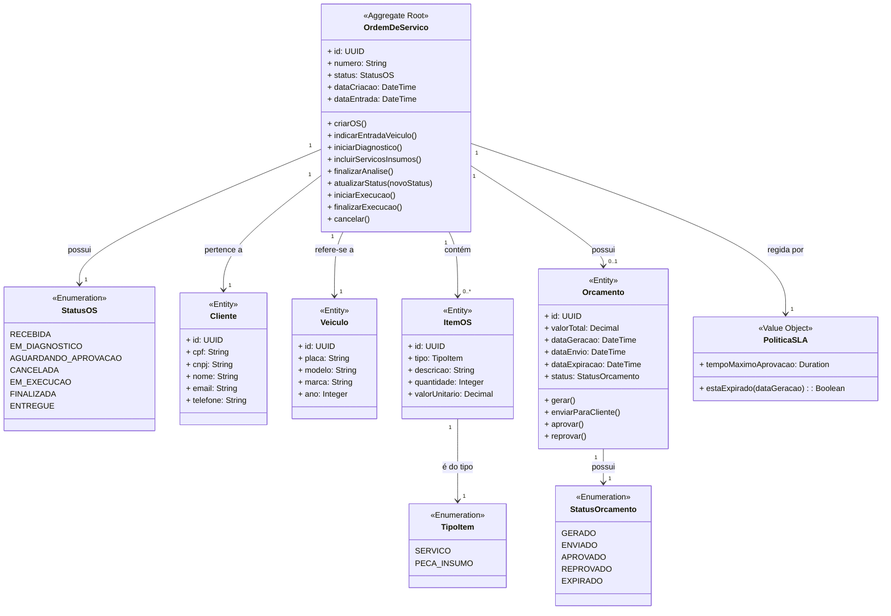
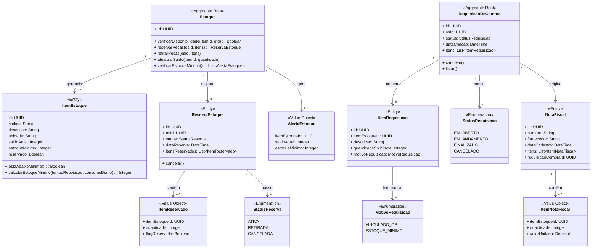
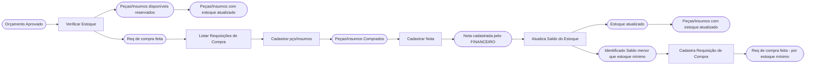
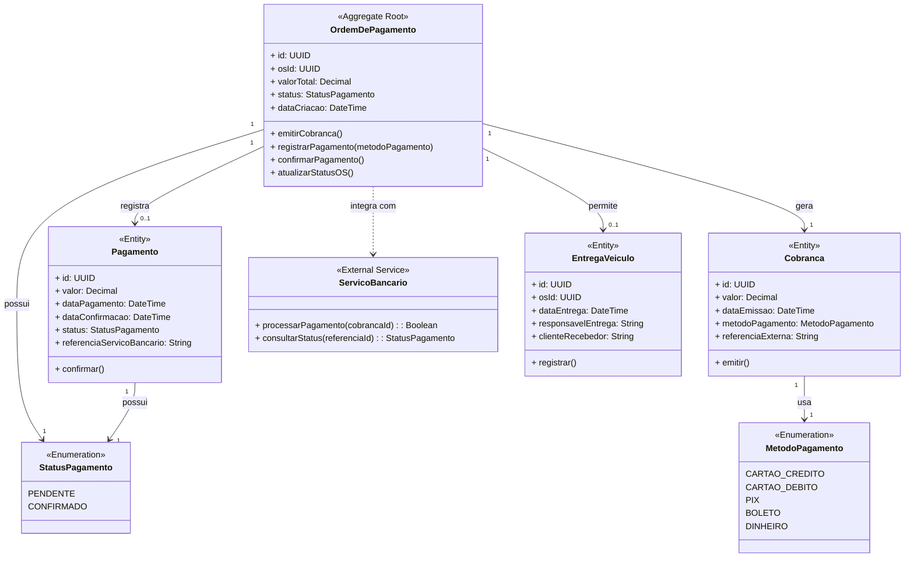

```mermaid
flowchart LR
    EV1([Ordem de Serviço Criada]) --> EV2([Cliente Identificado])
    EV2 --> EV3([Veículo Identificado])
    EV3 --> EV4([Serviço Incluído])
    EV4 --> EV5([OS atualizada para RECEBIDA])
    EV5 --> EV6([Diagnóstico Iniciado])
    EV6 --> EV7([OS atualizada para EM DIAGNÓSTICO])
    EV7 --> EV8([OS atualizada com serviços e insumos])
    EV8 --> EV9([Orçamento gerado])
    EV9 --> EV10([Orçamento enviado para o cliente])
    EV10 --> EV11([OS atualizada para AGUARDANDO APROVAÇÃO])
    EV11 -->|Aprovado| EV12([Orçamento Aprovado])
    EV11 -->|Reprovado / SLA expirado| EV13([OS ATUALIZADA PARA CANCELADA])
    EV12 --> EV14([Execução iniciada])
    EV14 --> EV15([Status atualizado EM EXECUÇÃO])
    EV15 --> EV16([Execução finalizada])
    EV16 --> EV17([OS atualizada para FINALIZADA])
    EV17 --> EV18([Cobrança emitida])
    EV18 --> EV19([Pagamento confirmado])
    EV19 --> EV20([Veículo entregue])
    EV20 --> EV21([OS status atualizada ENTREGUE])
```

```mermaid
flowchart LR
    EV1([OS atualizada para FINALIZADA]) --> CMD1[Emitir Cobrança]
    CMD1 --> EV2([Cobrança emitida])
    EV2 --> CMD2[Preencher campo PAGAMENTO PENDENTE]
    CMD2 --> EV3([Campo atualizado PAGAMENTO PENDENTE])
    EV3 --> CMD3[Realizar Pagamento]
    CMD3 --> SVC[Serviço de Pagamento - Banco]
    SVC --> EV4([Pagamento confirmado])
    EV4 --> CMD4[Atualizar campo PAGAMENTO CONFIRMADO]
    CMD4 --> EV5([Campo atualizado PAGAMENTO CONFIRMADO])
    EV5 --> CMD5[Entregar Veículo ao Cliente]
    CMD5 --> EV6([Veículo entregue])
    EV6 --> CMD6[Atualizar Status OS para ENTREGUE]
    CMD6 --> EV7([OS status atualizada ENTREGUE])
```

# Diagramas de Agregados — Domain-Driven Design

> Transcrição dos diagramas de agregados identificados no board de Event Storming.  
> Fonte: [Miro Board](https://miro.com/app/board/uXjVHD4vUnU=/)

---

## 1. Contexto de Ordem de Serviço

O contexto de **Ordem de Serviço (OS)** é responsável por todo o ciclo de vida de uma OS: desde a identificação do cliente e veículo, passando pelo diagnóstico, geração e aprovação de orçamento, execução do serviço e entrega do veículo.

### Eventos de Domínio

---

## 2. Contexto de Gestão de Estoque

O contexto de **Gestão de Estoque** é responsável por controlar o saldo de peças e insumos, realizar reservas, gerar requisições de compra e registrar entradas via nota fiscal.

### Eventos de Domínio

---

## 3. Contexto de Ordem de Pagamento

O contexto de **Ordem de Pagamento** é responsável pela emissão de cobranças, processamento e confirmação de pagamentos após a conclusão do serviço, bem como pela entrega do veículo ao cliente.

### Eventos de Domínio

---

## Legenda

| Símbolo | Significado |
|---|---|
| `<<Aggregate Root>>` | Raiz do agregado — ponto de entrada e controle de consistência |
| `<<Entity>>` | Entidade com identidade própria dentro do agregado |
| `<<Value Object>>` | Objeto de valor imutável, sem identidade própria |
| `<<Enumeration>>` | Enumeração de estados ou tipos |
| `<<External Service>>` | Serviço externo ao bounded context |
| `EV` | Evento de Domínio |
| `CMD` | Comando |
| `POL` | Política (reação automática a um evento) |
| `AT` | Ator (usuário ou sistema que dispara o comando) |
| `ML` | Mock-up / Tela |
| `SE` | Sistema Externo |
| `AG` | Agregado |
