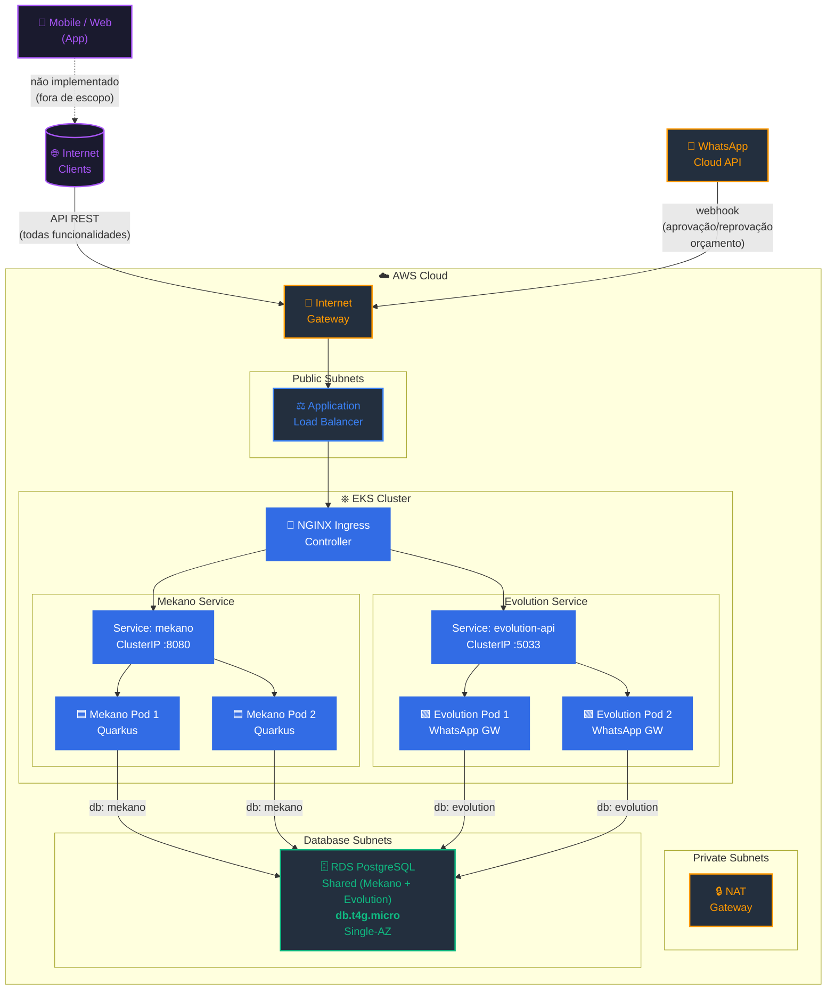

# Global Scope Architecture — Mekano API (AWS)

> Diagrama de arquitetura global do sistema Mekano em produção na AWS.  
> Escopo: fluxo completo desde o cliente até os serviços externos.

---

## Arquitetura Principal

> **Nota:** A aplicação Mobile/Web (front-end) **não faz parte do escopo** deste projeto.  
> O WhatsApp é integrado apenas para funcionalidades limitadas: aprovação/reprovação de orçamento via webhook.  
> O acesso principal à API é feito via Internet (HTTP/HTTPS), consumido por clientes que utilizam os endpoints REST.

---

## Fluxo de Dados — WhatsApp

```mermaid
sequenceDiagram
    autonumber
    participant C as 🌐 Cliente WhatsApp
    participant WA as 📱 WhatsApp Cloud API
    participant EVO as 🟩 Evolution API
    participant MW as 🔀 Webhook Resource
    participant API as 🟦 Mekano API
    participant DB as 🗄️ RDS PostgreSQL<br/>(shared: mekano + evolution)

    rect rgb(30, 41, 59)
        Note over C, DB: Fluxo de Mensagem Recebida
        C->>WA: Envia mensagem (SIM/NÃO)
        WA->>EVO: POST /webhook
        EVO->>MW: POST /api/v1/webhooks/evolution
        MW->>MW: Valida token (x-webhook-token)
        alt Token inválido
            MW-->>WA: 401 Unauthorized
        else Token válido
            MW->>API: processarResposta(remoteJid, texto)
            API->>API: Normaliza texto (SIM/s/NÃO/n)
            API->>DB: @Transactional — atualiza status OS
            DB-->>API: OK
            API-->>MW: Orçamento atualizado
            MW-->>WA: 200 OK
        end
    end

    rect rgb(30, 41, 59)
        Note over C, DB: Fluxo de Notificação
        API->>API: Evento de Domínio (ex: DiagnosticoFinalizadoEvent)
        API->>EVO: notificarCliente(telefone, mensagem)
        EVO->>WA: Envia mensagem WhatsApp
        WA-->>C: Notificação recebida
    end
```

---

## Fluxo de Dados — HTTP API

```mermaid
sequenceDiagram
    autonumber
    participant U as 👤 Usuário
    participant ALB as ⚖️ ALB
    participant NGX as 🔀 NGINX
    participant API as 🟦 Mekano API
    participant DB as 🗄️ RDS PostgreSQL<br/>(db: mekano)

    rect rgb(30, 41, 59)
        Note over U, DB: Requisição HTTP (GET/POST/PUT/DELETE)
        U->>ALB: HTTPS request
        ALB->>NGX: Forward (port 80)
        NGX->>API: Route by path (/api/v1/*)
        API->>API: @RolesAllowed validation
        API->>DB: Query/Update
        DB-->>API: Result
        API-->>U: JSON Response (RFC 7807 on error)
    end
```

---

## Componentes

| Componente | Tipo | Função |
|------------|------|--------|
| **Internet Gateway** | AWS Network | Ponto de entrada/saída da VPC para a internet |
| **Application Load Balancer** | AWS Compute | Distribui tráfego HTTPS entre pods EKS |
| **EKS Cluster** | AWS Compute | Kubernetes gerenciado — orquestra pods |
| **NGINX Ingress Controller** | K8s Ingress | Roteamento L7, TLS termination, rate limiting |
| **Mekano API (Pods)** | K8s Deployment | API REST Quarkus — gestão de oficina mecânica |
| **Evolution API (Pods)** | K8s Deployment | Gateway WhatsApp — mensagens e webhooks |
| **RDS PostgreSQL (Shared)** | AWS Database | Banco compartilhado — Mekano (db: mekano) + Evolution (db: evolution) |
| **NAT Gateway** | AWS Network | Saída de rede para pods em subnets privadas |
| **WhatsApp Cloud API** | External | API oficial Meta para mensagens WhatsApp |

---

## Decisões de Arquitetura

| Decisão | Justificativa |
|---------|---------------|
| **EKS (não ECS)** | Flexibilidade de scaling, suporte a NGINX Ingress, Helm charts |
| **RDS Single-AZ (Shared)** | Custo-eficiência — Evolution e Mekano compartilham a mesma instância RDS, databases separados |
| **Cache Local (não Redis)** | Evolution API usa cache local — reduz custo Eliminando ElastiCache Redis |
| **NGINX Ingress** | Rate limiting, TLS, roteamento por path |
| **Subnets de DB isoladas** | Segurança — acesso apenas via security groups internos |
| **NAT Gateway em Private Subnet** | Pods privados acessam internet (updates, webhooks externos) |
