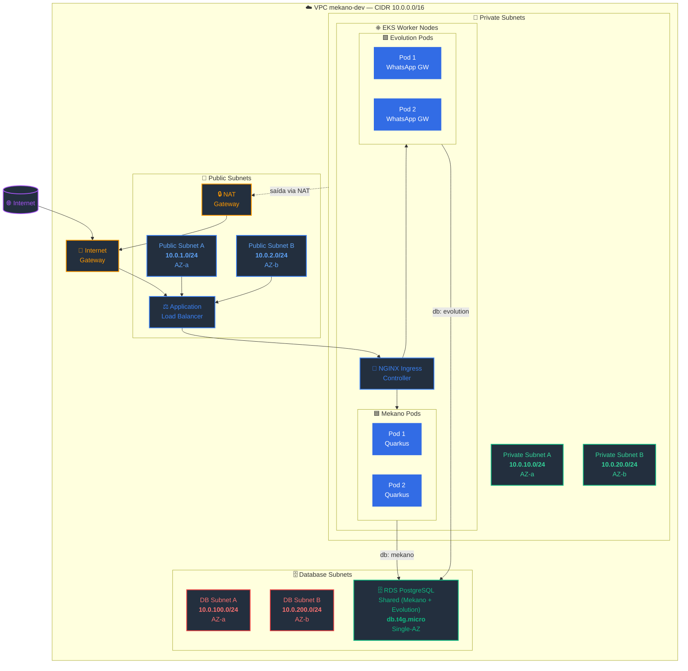
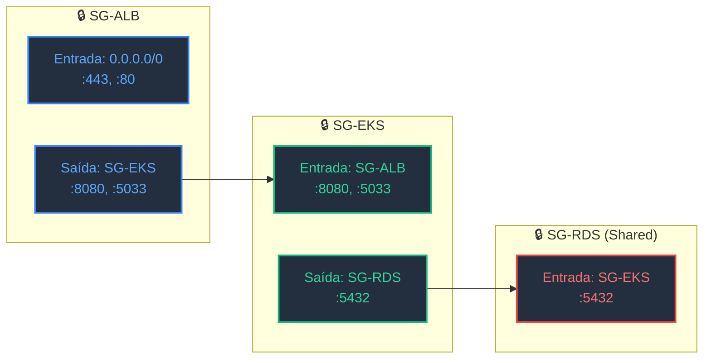

# VPC Scope Architecture — Mekano API (AWS)

> Diagrama de arquitetura da VPC do sistema Mekano em produção na AWS.  
> Escopo: layout de subnets, componentes de rede e fluxo de tráfego.

---

## Diagrama da VPC

---

## Fluxo de Tráfego

```mermaid
sequenceDiagram
    autonumber
    participant NET as 🌐 Internet
    participant IGW as 🚪 IGW
    participant ALB as ⚖️ ALB
    participant NGX as 🔀 NGINX
    participant API as 🟦 Mekano API
    participant EVO as 🟩 Evolution API
    participant DB as 🗄️ RDS<br/>(shared)

    rect rgb(35, 47, 62)
        Note over NET, NGX: 🔵 Tráfego de Entrada (Inbound)
        NET->>IGW: HTTPS request
        IGW->>ALB: Forward (port 443)
        ALB->>NGX: Route by host/path
        NGX->>API: /api/v1/* (port 8080)
        NGX->>EVO: /api/v1/webhooks/* (port 5033)
    end

    rect rgb(20, 40, 35)
        Note over API, DB: 🟢 Tráfego Interno (Private — Database Subnets)
        API->>DB: Query/Update (port 5432) — db: mekano
        DB-->>API: Result
        EVO->>DB: Query (port 5432) — db: evolution
        DB-->>EVO: Result
    end

    rect rgb(45, 35, 20)
        Note over NET, DB: 🟠 Tráfego de Saída (Outbound via NAT Gateway)
        API->>NGX: Response
        NGX->>ALB: Forward
        ALB->>IGW: HTTPS response
        IGW->>NET: Internet
    end
```

---

## Fluxo de Segurança — Security Groups

---

## Security Groups

| Security Group | Regras de Entrada | Regras de Saída |
|----------------|-------------------|-----------------|
| **SG-ALB** | `0.0.0.0/0` :443, :80 | SG-EKS :8080, :5033 |
| **SG-EKS** | SG-ALB :8080, :5033 | SG-RDS :5432 |
| **SG-RDS (Shared)** | SG-EKS :5432 | — |

---

## Route Tables

| Route Table | Destino | Target |
|-------------|---------|--------|
| **RT-Public** | `10.0.0.0/16` | local |
| **RT-Public** | `0.0.0.0/0` | Internet Gateway |
| **RT-Private** | `10.0.0.0/16` | local |
| **RT-Private** | `0.0.0.0/0` | NAT Gateway |
| **RT-DB** | `10.0.0.0/16` | local |
| **RT-DB** | `0.0.0.0/0` | NAT Gateway |

---

## Subnets Summary

| Subnet | CIDR | AZ | Uso |
|--------|------|-----|-----|
| Public A | `10.0.1.0/24` | AZ-a | ALB, NAT Gateway |
| Public B | `10.0.2.0/24` | AZ-b | ALB (redundância) |
| Private A | `10.0.10.0/24` | AZ-a | EKS Workers, pods |
| Private B | `10.0.20.0/24` | AZ-b | EKS Workers, pods |
| DB A | `10.0.100.0/24` | AZ-a | RDS |
| DB B | `10.0.200.0/24` | AZ-b | RDS |

---

## Decisões de Rede

| Decisão | Justificativa |
|---------|---------------|
| **3 tiers de subnets** | Isolamento de segurança — público (ALB), privado (EKS), banco (RDS) |
| **RDS Single-AZ (Shared)** | Custo-eficiência — Evolution e Mekano compartilham a mesma instância RDS, databases separados |
| **NAT Gateway em Public Subnet** | Custo — um NAT por VPC; pods privados saem pela internet |
| **SGs mínimos** | Princípio de menor privilégio — cada SG só expõe portas necessárias |
| **DB Subnets sem rota para internet** | Segurança — bancos não acessíveis externamente |
| **CIDR /16** | 65.536 IPs disponíveis — espaço para crescimento |
| **Cache Local (não Redis)** | Evolution API usa cache local — sem ElastiCache Redis |
