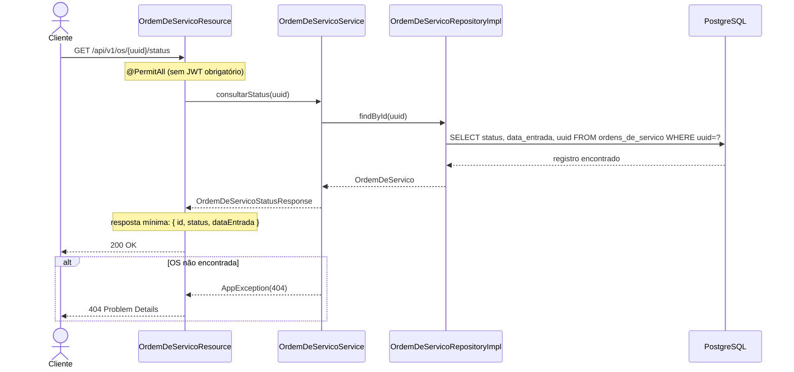

# Consulta pública de status da OS

Fluxo público de consulta sem autenticação para acompanhar andamento da OS.

```mermaid
sequenceDiagram
    actor Cliente
    participant API as OrdemDeServicoResource
    participant App as OrdemDeServicoService
    participant Repo as OrdemDeServicoRepositoryImpl
    participant DB as PostgreSQL

    Cliente->>API: GET /api/v1/os/{uuid}/status
    Note over API: @PermitAll (sem JWT obrigatório)

    API->>App: consultarStatus(uuid)
    App->>Repo: findById(uuid)
    Repo->>DB: SELECT status, data_entrada, uuid FROM ordens_de_servico WHERE uuid=?
    DB-->>Repo: registro encontrado
    Repo-->>App: OrdemDeServico

    App-->>API: OrdemDeServicoStatusResponse
    Note over API: resposta mínima: { id, status, dataEntrada }
    API-->>Cliente: 200 OK

    alt OS não encontrada
        App-->>API: AppException(404)
        API-->>Cliente: 404 Problem Details
    end
```
