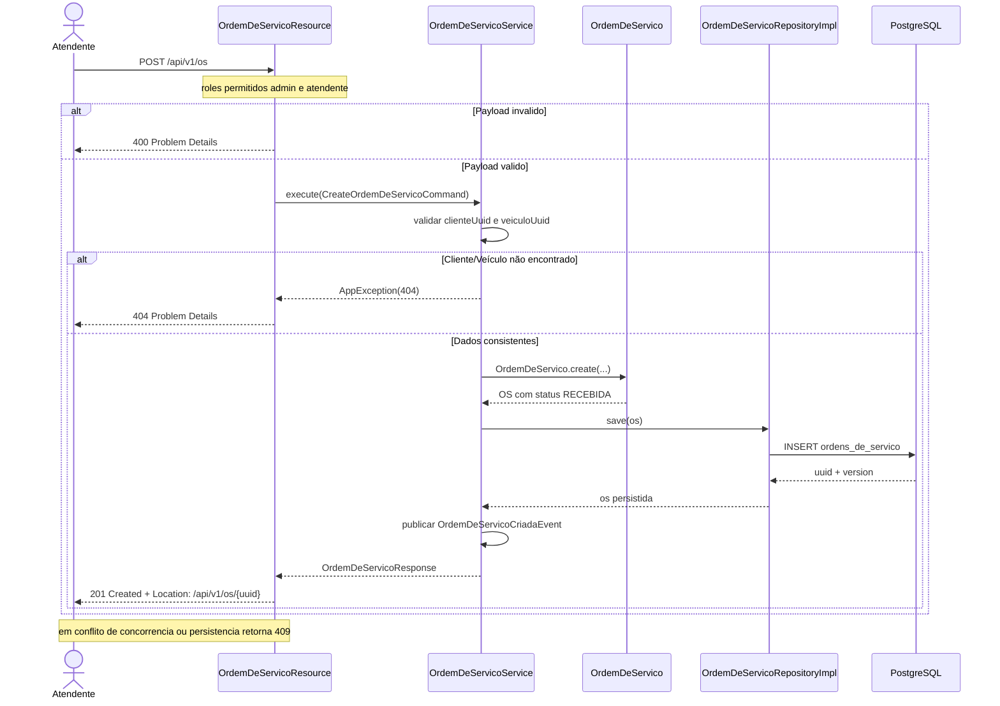

# Criar OS

Fluxo de criação de ordem de serviço pela camada REST até persistência.

```mermaid
sequenceDiagram
    actor Atendente
    participant API as OrdemDeServicoResource
    participant App as OrdemDeServicoService
    participant Domain as OrdemDeServico
    participant Repo as OrdemDeServicoRepositoryImpl
    participant DB as PostgreSQL

    Atendente->>API: POST /api/v1/os
    Note over API: roles permitidos admin e atendente

    alt Payload invalido
        API-->>Atendente: 400 Problem Details
    else Payload valido
        API->>App: execute(CreateOrdemDeServicoCommand)
        App->>App: validar clienteUuid e veiculoUuid

        alt Cliente/Veículo não encontrado
            App-->>API: AppException(404)
            API-->>Atendente: 404 Problem Details
        else Dados consistentes
            App->>Domain: OrdemDeServico.create(...)
            Domain-->>App: OS com status RECEBIDA

            App->>Repo: save(os)
            Repo->>DB: INSERT ordens_de_servico
            DB-->>Repo: uuid + version
            Repo-->>App: os persistida

            App->>App: publicar OrdemDeServicoCriadaEvent
            App-->>API: OrdemDeServicoResponse
            API-->>Atendente: 201 Created + Location: /api/v1/os/{uuid}
        end
    end

    Note over API,Atendente: em conflito de concorrencia ou persistencia retorna 409
```
