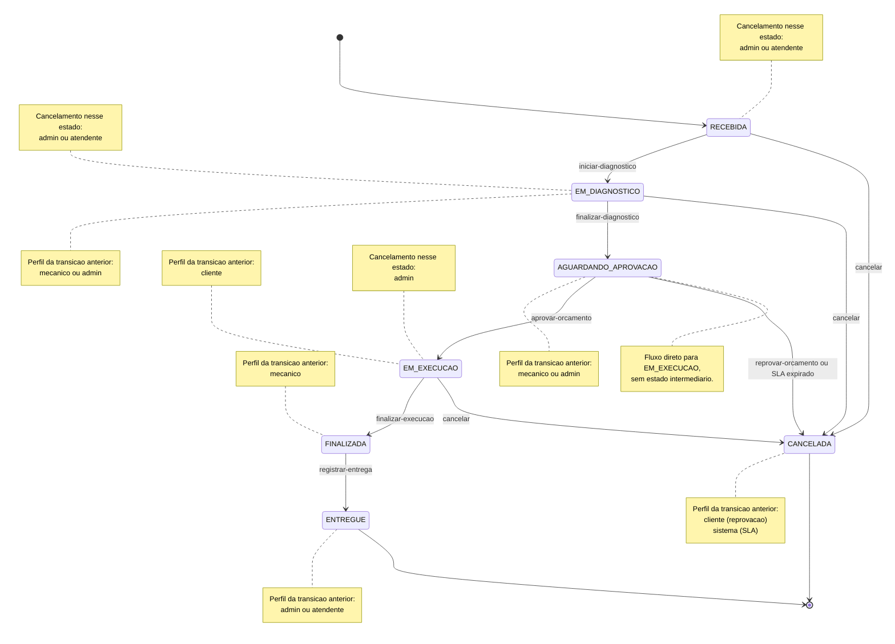

# Fluxo completo do ciclo de vida da OS

Maquina de estados da OS conforme regras de negocio do projeto.

```mermaid
stateDiagram-v2
    [*] --> RECEBIDA

    RECEBIDA --> EM_DIAGNOSTICO: iniciar-diagnostico
    note right of EM_DIAGNOSTICO
      Perfil da transicao anterior:
      mecanico ou admin
    end note

    EM_DIAGNOSTICO --> AGUARDANDO_APROVACAO: finalizar-diagnostico
    note right of AGUARDANDO_APROVACAO
      Perfil da transicao anterior:
      mecanico ou admin
    end note

    AGUARDANDO_APROVACAO --> EM_EXECUCAO: aprovar-orcamento
    note left of EM_EXECUCAO
      Perfil da transicao anterior:
      cliente
    end note

    AGUARDANDO_APROVACAO --> CANCELADA: reprovar-orcamento ou SLA expirado
    note right of CANCELADA
      Perfil da transicao anterior:
      cliente (reprovacao)
      sistema (SLA)
    end note

    EM_EXECUCAO --> FINALIZADA: finalizar-execucao
    note left of FINALIZADA
      Perfil da transicao anterior:
      mecanico
    end note

    FINALIZADA --> ENTREGUE: registrar-entrega
    note right of ENTREGUE
      Perfil da transicao anterior:
      admin ou atendente
    end note

    RECEBIDA --> CANCELADA: cancelar
    note left of RECEBIDA
      Cancelamento nesse estado:
      admin ou atendente
    end note

    EM_DIAGNOSTICO --> CANCELADA: cancelar
    note left of EM_DIAGNOSTICO
      Cancelamento nesse estado:
      admin ou atendente
    end note

    EM_EXECUCAO --> CANCELADA: cancelar
    note left of EM_EXECUCAO
      Cancelamento nesse estado:
      admin
    end note

    CANCELADA --> [*]
    ENTREGUE --> [*]

    note right of AGUARDANDO_APROVACAO
      Fluxo direto para EM_EXECUCAO,
      sem estado intermediario.
    end note
```
