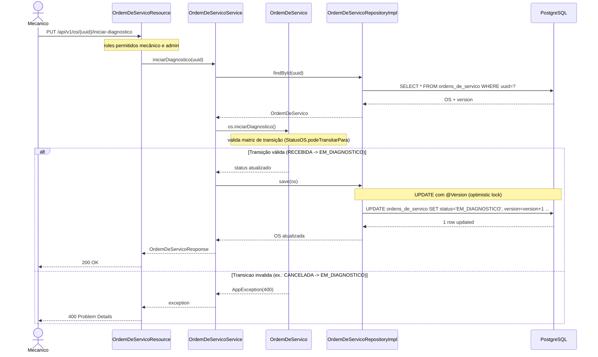

# Iniciar diagnóstico

Fluxo para transição da OS de RECEBIDA para EM_DIAGNOSTICO.

```mermaid
sequenceDiagram
    actor Mecanico
    participant API as OrdemDeServicoResource
    participant App as OrdemDeServicoService
    participant Domain as OrdemDeServico
    participant Repo as OrdemDeServicoRepositoryImpl
    participant DB as PostgreSQL

    Mecanico->>API: PUT /api/v1/os/{uuid}/iniciar-diagnostico
    Note over API: roles permitidos mecânico e admin

    API->>App: iniciarDiagnostico(uuid)
    App->>Repo: findById(uuid)
    Repo->>DB: SELECT * FROM ordens_de_servico WHERE uuid=?
    DB-->>Repo: OS + version
    Repo-->>App: OrdemDeServico

    App->>Domain: os.iniciarDiagnostico()
    Note over Domain: valida matriz de transição (StatusOS.podeTransitarPara)

    alt Transição válida (RECEBIDA -> EM_DIAGNOSTICO)
        Domain-->>App: status atualizado
        App->>Repo: save(os)
        Note over Repo,DB: UPDATE com @Version (optimistic lock)
        Repo->>DB: UPDATE ordens_de_servico SET status='EM_DIAGNOSTICO', version=version+1 ...
        DB-->>Repo: 1 row updated
        Repo-->>App: OS atualizada
        App-->>API: OrdemDeServicoResponse
        API-->>Mecanico: 200 OK
    else Transicao invalida (ex.: CANCELADA -> EM_DIAGNOSTICO)
        Domain-->>App: AppException(400)
        App-->>API: exception
        API-->>Mecanico: 400 Problem Details
    end
```
