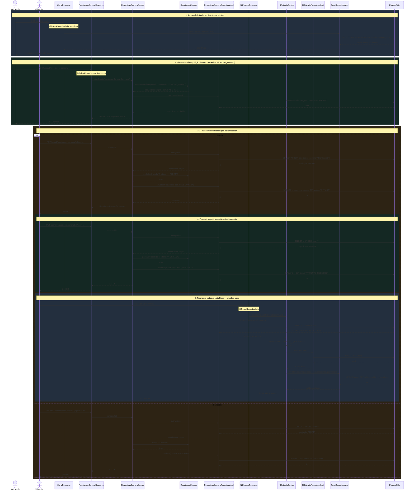

# Requisição de Compra — Estoque Mínimo

Flujo de reposição de estoque: do alerta de estoque mínimo até cadastro de NF e atualização de saldo.

```mermaid
sequenceDiagram
    actor Almoxarife
    actor Financeiro
    participant AlertAPI as AlertaResource
    participant ReqAPI as RequisicaoCompraResource
    participant ReqApp as RequisicaoCompraService
    participant ReqDomain as RequisicaoCompra
    participant ReqRepo as RequisicaoCompraRepositoryImpl
    participant NfAPI as NfEntradaResource
    participant NfApp as NfEntradaService
    participant NfRepo as NfEntradaRepositoryImpl
    participant PecaRepo as PecaRepositoryImpl
    participant DB as PostgreSQL

    rect rgb(35, 47, 62)
        Note over Almoxarife,DB: 1. Almoxarife lista alertas de estoque mínimo
        Almoxarife->>AlertAPI: GET /api/v1/alertas
        Note over AlertAPI: @RolesAllowed admin, atendente
        AlertAPI->>PecaRepo: listarAbaixoEstoqueMinimo()
        PecaRepo->>DB: SELECT * FROM pecas WHERE saldo < estoque_minimo
        DB-->>PecaRepo: peças abaixo do mínimo
        PecaRepo-->>AlertAPI: List<Peca>
        AlertAPI-->>Almoxarife: 200 OK — List<AlertaResponse>
    end

    rect rgb(20, 40, 35)
        Note over Almoxarife,DB: 2. Almoxarife cria requisição de compra (motivo: ESTOQUE_MINIMO)
        Almoxarife->>ReqAPI: POST /api/v1/requisicoes-compra
        Note over ReqAPI: @RolesAllowed admin, financeiro
        ReqAPI->>ReqApp: criar(CreateRequisicaoCompraCommand)
        ReqApp->>ReqDomain: criarParaMinimo(pecaId, quantidade, ESTOQUE_MINIMO)
        ReqDomain-->>ReqApp: RequisicaoCompra { status: ABERTA }
        ReqApp->>ReqRepo: save(requisicao)
        ReqRepo->>DB: INSERT requisicoes_compra (status='ABERTA')
        DB-->>ReqRepo: uuid
        ReqRepo-->>ReqApp: requisicao persistida
        ReqApp-->>ReqAPI: RequisicaoCompraResponse
        ReqAPI-->>Almoxarife: 201 Created
    end

    rect rgb(45, 35, 20)
        Note over Financeiro,DB: 3a. Financeiro envia requisição ao fornecedor
        alt Enviar
            Financeiro->>ReqAPI: PUT /api/v1/requisicoes-compra/{id}/enviar
            ReqAPI->>ReqApp: enviar(id)
            ReqApp->>ReqRepo: findById(id)
            ReqRepo->>DB: SELECT * FROM requisicoes_compra WHERE uuid=?
            DB-->>ReqRepo: requisição ABERTA
            ReqRepo-->>ReqApp: RequisicaoCompra
            ReqApp->>ReqDomain: podeSerEnviada()? (status == ABERTA)
            ReqDomain-->>ReqApp: true
            ReqApp->>ReqRepo: atualizar(requisicao com status ENVIADA)
            ReqRepo->>DB: UPDATE requisicoes_compra SET status='ENVIADA'
            DB-->>ReqRepo: ok
            ReqRepo-->>ReqApp: atualizada
            ReqApp-->>ReqAPI: RequisicaoCompraResponse
            ReqAPI-->>Financeiro: 200 OK

            rect rgb(20, 40, 35)
                Note over Financeiro,DB: 4. Financeiro registra recebimento do produto
                Financeiro->>ReqAPI: PUT /api/v1/requisicoes-compra/{id}/receber
                ReqAPI->>ReqApp: receber(id)
                ReqApp->>ReqRepo: findById(id)
                ReqRepo->>DB: SELECT ... WHERE uuid=?
                DB-->>ReqRepo: requisição ENVIADA
                ReqRepo-->>ReqApp: RequisicaoCompra
                ReqApp->>ReqDomain: podeSerRecebida()? (status == ENVIADA)
                ReqDomain-->>ReqApp: true
                ReqApp->>ReqRepo: atualizar(status PRODUTO_RECEBIDO)
                ReqRepo->>DB: UPDATE ... SET status='PRODUTO_RECEBIDO'
                DB-->>ReqRepo: ok
                ReqApp-->>ReqAPI: 200 OK
                ReqAPI-->>Financeiro: 200 OK
            end

            rect rgb(35, 47, 62)
                Note over Financeiro,DB: 5. Financeiro cadastra Nota Fiscal → atualiza saldo
                Financeiro->>NfAPI: POST /api/v1/nf-entrada
                Note over NfAPI: @RolesAllowed admin
                NfAPI->>NfApp: registrar(CreateNfEntradaCommand)
                NfApp->>ReqRepo: findById(requisicaoCompraId)
                ReqRepo->>DB: SELECT ... WHERE uuid=?
                DB-->>ReqRepo: requisição PRODUTO_RECEBIDO
                ReqRepo-->>NfApp: RequisicaoCompra
                NfApp->>NfApp: validar status == PRODUTO_RECEBIDO
                NfApp->>NfRepo: save(nfEntrada)
                NfRepo->>DB: INSERT nf_entrada
                DB-->>NfRepo: uuid
                NfRepo-->>NfApp: nf persistida
                NfApp->>PecaRepo: creditarSaldo(requisicao.pecaId, requisicao.quantidade)
                PecaRepo->>DB: UPDATE pecas SET saldo = saldo + :quantidade
                DB-->>PecaRepo: ok
                PecaRepo-->>NfApp: saldo atualizado
                NfApp-->>NfAPI: NfEntradaResponse
                NfAPI-->>Financeiro: 201 Created
            end

        else Cancelar
            Financeiro->>ReqAPI: PUT /api/v1/requisicoes-compra/{id}/cancelar
            ReqAPI->>ReqApp: cancelar(id)
            ReqApp->>ReqRepo: findById(id)
            ReqRepo->>DB: SELECT ... WHERE uuid=?
            DB-->>ReqRepo: requisição ABERTA
            ReqRepo-->>ReqApp: RequisicaoCompra
            ReqApp->>ReqDomain: status == ABERTA?
            ReqDomain-->>ReqApp: true
            ReqApp->>ReqRepo: atualizar(status CANCELADA)
            ReqRepo->>DB: UPDATE ... SET status='CANCELADA'
            DB-->>ReqRepo: ok
            ReqApp-->>ReqAPI: 200 OK
            ReqAPI-->>Financeiro: 200 OK
        end
    end
```
