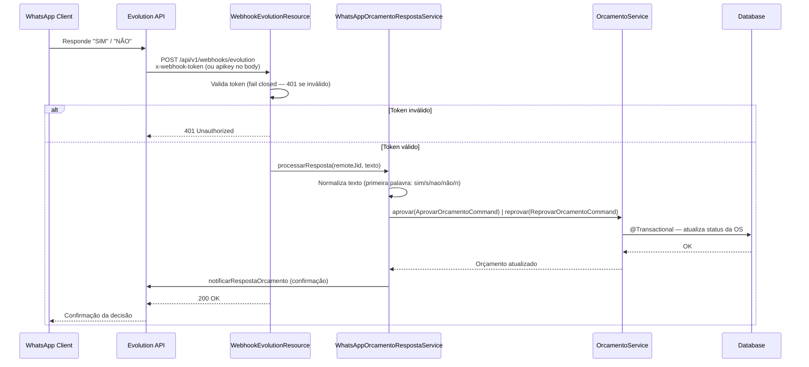

# WhatsApp — Escopo de Atualização de Status Externo (API-05)

## 1. Referência do Requisito

**API-05:** "Verificar escopo de atualização de status via ferramenta externa (WhatsApp/e-mail) — aplicar somente a aprovar/recusar orçamento?"

**Localização na fase 5:** o requisito é fechado pelo conjunto WPP-01 (notificação de orçamento + webhook de resposta), WPP-02 (notificação de retirada) e esta verificação documental. O WhatsApp é o único canal externo implementado — e-mail foi deliberadamente deixado fora de escopo (D-01).

## 2. Definição de Escopo (a resposta central)

**Sim — aplicar SOMENTE a aprovar/recusar orçamento.**

| Ação | Permitido | Transição |
|------|-----------|-----------|
| **Aprovar orçamento** | ✅ | OS: `AGUARDANDO_APROVACAO` → `AGUARDANDO_EXECUCAO` |
| **Reprovar orçamento** | ✅ | OS: `AGUARDANDO_APROVACAO` → `CANCELADA` |
| Iniciar diagnóstico | ❌ | — |
| Iniciar/finalizar execução | ❌ | — |
| Gerar cobrança | ❌ | — |
| Confirmar pagamento | ❌ | — |
| Registrar entrega | ❌ | — |
| Cancelar OS (fora de aprovação) | ❌ | — |
| Escritas no banco (CRUD clientes, veículos, peças, etc.) | ❌ | — |
| Leituras além dos endpoints `@PermitAll` existentes | ❌ | — |

## 3. Racional

1. **Segurança (ASVS V4 Access Control):** aprovar/reprovar orçamento são as únicas transições `@PermitAll` na API pública (`OrcamentoResource.java` linhas 66-92). O canal externo mapeia para o mesmo limite de permissão — sem ampliar a superfície.
2. **Endpoints públicos existentes:** `POST /orcamentos/{uuid}/aprovar` e `POST /orcamentos/{uuid}/reprovar` já são `@PermitAll` — o WhatsApp reutiliza o mesmo modelo de autorização (posse do orçamento por UUID).
3. **Decisão binária única:** aprovação/reprovação de orçamento é uma decisão única e de alto impacto. As demais transições exigem julgamento profissional (mecânico inicia diagnóstico/execução) ou papel autenticado (admin registra entrega).
4. **D-12 explícito:** "Cliente pode aprovar/recusar orçamento via WhatsApp (webhook processa resposta e chama endpoint de aprovação interno). WhatsApp não substitui a API pública — é um canal adicional."
5. **Simplicidade:** adicionar mais fluxos interativos exigiria gestão de estado de conversa e aprovação de templates — diferido (RESEARCH.md §Deferred Ideas).

## 4. Fluxo de Arquitetura

## 5. Limite de Segurança

- **Controle de acesso:** WhatsApp é um canal adicional para a MESMA operação `@PermitAll`. O cliente precisa conhecer o UUID do orçamento (escopado à sua OS) e o telefone cadastrado no sistema.
- **Autenticação:** o webhook valida `x-webhook-token` (header) **ou** `apikey` (body — enviada automaticamente pela Evolution API) contra `EVOLUTION_WEBHOOK_SECRET`/`EVOLUTION_WEBHOOK_TOKEN` → 401 em token ausente/inválido (fail closed, CR-02; comparação em tempo constante via `MessageDigest.isEqual`). A aprovação/reprovação usa posse por UUID (modelo existente).
- **Rate limiting:** o WhatsApp passa pelo mesmo `OrcamentoService` — qualquer limitação aplica-se transitivamente; o estado atual é compartilhado entre os canais.
- **Auditoria:** toda aprovação/reprovação é auditada pelo `OsAuditLogObserver` (transições de status já são auditadas).
- **PII:** telefone nunca é logado completo — `maskPhone()` no notifier e logs apenas com UUID do cliente (V8).

## 6. Checklist de Verificação de Implementação

| Componente | Arquivo | Status |
|------------|---------|--------|
| WhatsAppNotifierPort — port de domínio (05-01) | `mekano-domain/src/main/java/com/fiap/mekano/domain/port/out/WhatsAppNotifierPort.java` | [x] |
| EvolutionApiNotifier — implementação infrastructure (05-01) | `mekano-infrastructure/src/main/java/com/fiap/mekano/infrastructure/whatsapp/EvolutionApiNotifier.java` | [x] |
| WhatsAppOrcamentoObserver — trigger em DiagnosticoFinalizadoEvent (05-01) | `mekano-infrastructure/src/main/java/com/fiap/mekano/infrastructure/observer/WhatsAppOrcamentoObserver.java` | [x] |
| WhatsAppPagamentoObserver — trigger em PagamentoConfirmadoEvent (05-02) | `mekano-infrastructure/src/main/java/com/fiap/mekano/infrastructure/observer/WhatsAppPagamentoObserver.java` | [x] |
| WebhookEvolutionResource — POST /api/v1/webhooks/evolution (05-01/05-02) | `mekano-rest/src/main/java/com/fiap/mekano/rest/api/WebhookEvolutionResource.java` | [x] |
| WhatsAppOrcamentoRespostaService — processa resposta e chama aprovar/reprovar (05-02) | `mekano-application/src/main/java/com/fiap/mekano/application/service/whatsapp/WhatsAppOrcamentoRespostaService.java` | [x] |
| Webhook valida token → 401 em inválido (fail closed) | `WebhookEvolutionResource.java` — `tokenValido()` | [x] |
| OrcamentoService chamado via commands transacionais | `WhatsAppOrcamentoRespostaService.java` → `OrcamentoServicePort` | [x] |
| Formato da resposta: texto livre "SIM"/"NÃO" (primeira palavra exata, WR-03) | `WhatsAppOrcamentoRespostaService.java` — `processarResposta()` | [x] |

**Nota de divergência do plano 05-02:** o plano original previa `WhatsAppWebhookResource` em `/webhooks/whatsapp` com botões `approve_orc_<uuid>`/`reject_orc_<uuid>`. A implementação real (aprovada na PR #104) usa `WebhookEvolutionResource` em `/webhooks/evolution` com resposta por **texto livre** ("SIM"/"NÃO"), validada pela primeira palavra após normalização — mesmos critérios de aceite (401/200 e chamada a `aprovar`/`reprovar`), sem duplicação de endpoint.

## 7. Decisões de Limite (Fora de Escopo)

- **E-mail como canal externo:** não implementado. WhatsApp é o único canal externo (D-01). Notificação por e-mail exigiria integração separada.
- **Outras transições de status via WhatsApp:** não implementadas, conforme §2. Fases futuras PODEM adicionar fluxos interativos se houver suporte a conversas bidirecionais.
- **Suporte multilíngue:** fora de escopo — mensagens apenas em português brasileiro.
- **Confirmação de pagamento via WhatsApp:** diferida (STATE.md §Deferred Items — gateway real de pagamento é v2.x).

## 8. Cross-References

- **D-04** (CONTEXT.md): notificar quando orçamento é criado; link para endpoints `@PermitAll`
- **D-06** (CONTEXT.md): cliente interage via WhatsApp — sistema expõe webhook para a Evolution API
- **D-12** (CONTEXT.md): WhatsApp é canal adicional, não substitui a API pública
- RESEARCH.md §Security Domain e §Pitfall 3 (webhook transacional)
- `OrcamentoResource.java` — endpoints `@PermitAll` existentes (linhas 66-92)
- `WebhookEvolutionResource.java` — endpoint do webhook (05-01/05-02)
- `WhatsAppOrcamentoRespostaService.java` — processamento da resposta (05-02)